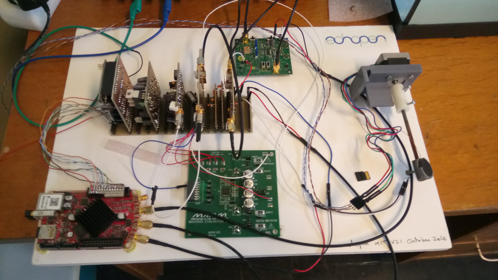
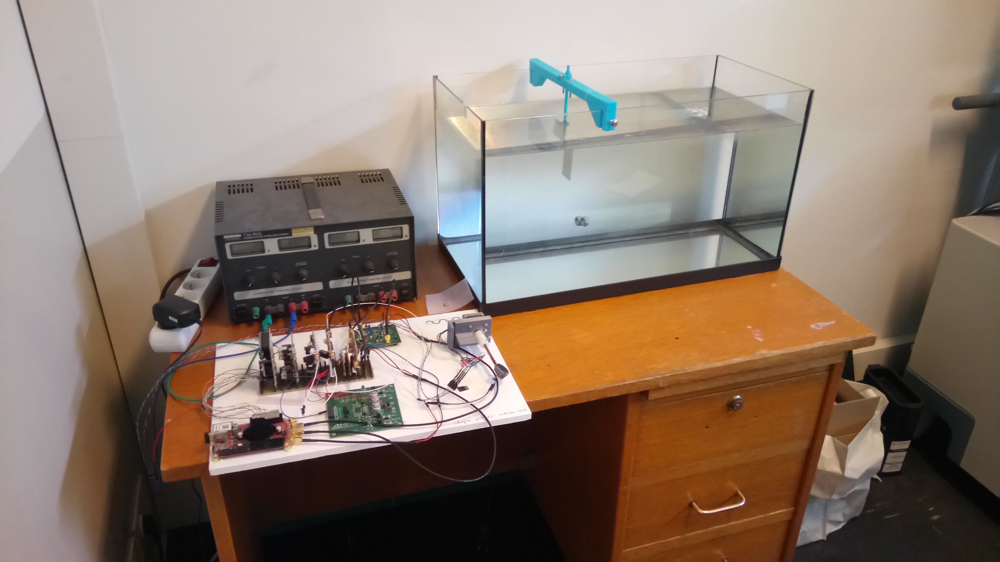

# Configuration

## Name
[`CFG-aquarium_kit`]()

## Title
Kit 2.1 - Oct 2016

## About

## Uses
* [`DVC-aquarium`](../../mecanic/device/DVC-aquarium)
* [`MDL-transducer_v4`](../../electronic/modules/hardware/MDL-transducer/MDL-transducer_v4)
* [`MDL-power_supply_v1`](../../electronic/modules/hardware/MDL-power_supply/MDL-power_supply_v1)
* [`MDL-mother_board_v1`](../../electronic/modules/hardware/MDL-mother_board)
* [`MDL-redpitaya`](../../electronic/modules/hardware/MDL-redpitaya)
* [`MDL-motor_v2`](../../electronic/modules/hardware/MDL-motor/MDL-motor_v2)
* [`DB-supply_v1`](../../electronic/daughter_boards/DB-supply/DB-supply_v1)
* [`DB-high_voltage_v1`](../../electronic/daughter_boards/DB-high_voltage/DB-high_voltage_v1)
* [`DB-motor_control_v3`](../../electronic/daughter_boards/DB-motor_control/DB-motor_control_v3)
* [`DB-pulser_v2`](../../electronic/daughter_boards/DB-pulser/DB-pulser_v2)
* [`DB-filter_v1`](../../electronic/daughter_boards/DB-filter/DB-filter_v1)
* [`DB-envelope_detector_v1`](../../electronic/daughter_boards/DB-envelope_detector/DB-envelope_detector_v1)
* [`DB-tr_switch_tgc_v1`](../../electronic/daughter_boards/DB-tr_switch_tgc/DB-tr_switch_tgc_v1)

The sources of the code can be found [here](../../electronic/modules/software), select your configuration. Details on how to put the code on the arduino and the RedPitaya can be found [here](../../installation/linux_user/readme.md).