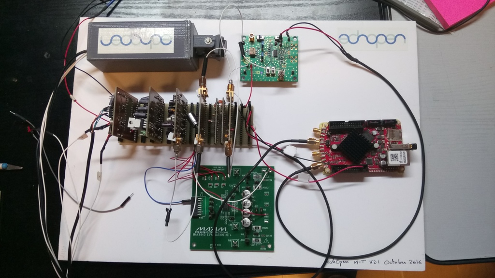

# Configuration

## Name
[`CFG-sweeping_probe`]()

## Title
Sweeping probe

## Uses
* [`DVC-sweeping_probe`](../../mecanic/device/DVC-sweeping_probe)
* [`MDL-transducer_v4`](../../electronic/modules/hardware/MDL-transducer/MDL-transducer_v4)
* [`MDL-power_suplly_v1`](../../electronic/modules/hardware/MDL-power_supply/MDL-power_supply_v1)
* [`MDL-mother_board`](../../electronic/modules/hardware/MDL-mother_board)
* [`DB-supply_v1`](../../electronic/daughter_boards/DB-supply/DB-supply_v1)
* [`DB-high_voltage_v1`](../../electronic/daughter_boards/DB-high_voltage/DB-high_voltage_v1)
* [`DB-motor_control_v1`](../../electronic/daughter_boards/DB-motor_control/DB-motor_control_v1)
* [`DB-pulser_v2`](../../electronic/daughter_boards/DB-pulser/DB-pulser_v2)
* [`DB-filter_v1`](../../electronic/daughter_boards/DB-filter/DB-filter_v1)
* [`DB-envelope_detector_v1`](../../electronic/daughter_boards/DB-envelope_detector/DB-envelope_detector_v1)
* [`DB-tr_switch_tgc_v1`](../../electronic/daughter_boards/DB-tr_switch_tgc/DB-tr_switch_tgc_v1)

## Description
