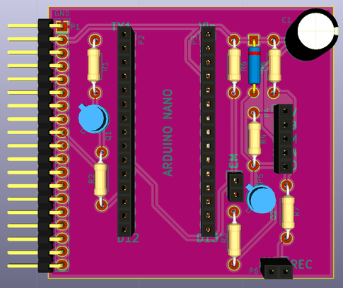

# Daughter board

## Name
[`DB-motor_control_v1`]()

## Title
Daughter board motor control version 1

## Author
* [`PRS-jerome_dubois`]()

## Modules included
* [`MDL-motor_control_v1`]()

## Interfaces
### Input
* [`ITF-A_gnd`]()
* [`ITF-B_5v`]()
* [`ITF-S_3_3v`]()

### Output
* [`ITF-A_gnd`]()
* [`ITF-I_pulse_on`]()
* [`ITF-J_pulse_off`]()
* [`ITF-K_pulse_redpitaya`]()

##External connections
### Input
* toptour EM (P6)

### Output
* motor connection (P4)
* toptour REC (P5)

## Scheme

## Remarks
[BOM](./src/DB-motor_control_v1.csv)

The arduino nano is plug on the two 1*15 straight socket connector even if it is not shown on the scheme. The orientation of the arduino is given on the PCB with the incation: TX1, VIN, D12, D13. This daughter board is used for controling CC motors (MDL_motor_v1). Socket P4, P5 and P6 are plugs for the motor (P4), toptour emission (P5 for the photo-diode) and reception (P6 for the photo-transistor).

## Results

## Pros/Cons/Constraint:

**Pros:** NA

**Cons:** NA

**Constraint:** NA
