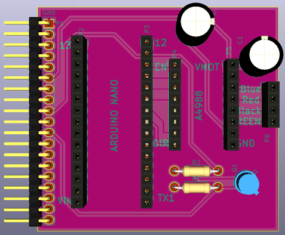

# Daughter board

## Name
[`DB-motor_control_v2`]()

## Title
Daughter board motor control version 2

## Author
* [`PRS-jerome_dubois`]()

## Modules included
* [`MDL-motor_control_v2`]()

## Interfaces
### Input
* [`ITF-A_gnd`]()
* [`ITF-B_5v`]()
* [`ITF-F_12v`]()

### Output
* [`ITF-A_gnd`]()
* [`ITF-I_pulse_on`]()
* [`ITF-J_pulse_off`]()
* [`ITF-K_pulse_redpitaya`]()
* stepper A1
* stepper A2
* stepper B1
* stepper B2

##External connections
### Input
* NA

### Output
* stepper A1, A2, B1, B2 (P6)

## Scheme

## Remarks
[BOM](./src/DB-motor_control_v2.csv)

This daughter board is for driving stepper motor MDL-motor_v2. An arduino is pluged on socket P2 and P3, a stepper driver [pololu A4988](./doc/pololu_a4988.pdf) is plugged on socket P4 and P5 and stepper motor is plugged on socket P6. Instruction about the orientation of them is writen on the PCB.

## Results

## Pros/Cons/Constraint:

**Pros:** NA

**Cons:** NA

**Constraint:** NA
