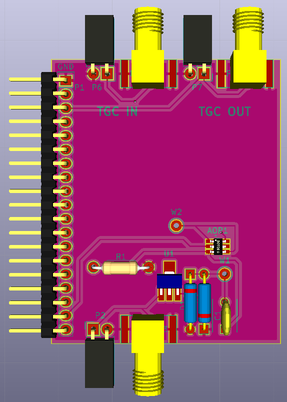

# Daughter board

## Name
[`DB-tr_switch_tgc_v1`]()

## Title
Daughter board T/R switch, TGC version 1

## Author
* [`CTC-dubois_jerome`]()

## Modules included
* [`MDL-tr_switch_v1`]()
* [`MDL-tgc_v1`]()

## Interfaces
### Input
* [`ITF-A_gnd`]()
* [`ITF-B_5v`]()
* [`ITF-R_neg_5v`]()

### Output
* [`ITF-A_gnd`]()
* [`ITF-C-amplified_raw_signal`]()

##External connections
### Input
* DB_pulser output (P2, P3)
* AD8331_EVALZ output (P7, P9)

### Output
* AD8331_EVALZ input (P6, P8)

## Scheme

## Remarks
[BOM](./src/DB-tr_switch_tgc_v1.csv)

This daughter board use an AD8331_EVALZ (evaluation kit of AD8331 IC), the input of this evaluation kit is connected to P6 or P8 of this daughter board and output to P7 or P9. The output of DB_pulser is plugged to P2 or P3.

AD8331_EVALZ need 5V supply and ramp command for the VGA.

Test point W1 is here to check that the signal is clamped by the MD0100 and test point W2 is here to to check that the input of the TGC is valid (between +/- 2.5V).

## Results

## Pros/Cons/Constraint:

**Pros:** NA

**Cons:** NA

**Constraint:** NA
