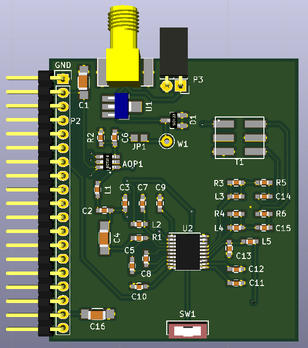

# Daughter board

## Name
[`DB-tr_switch_tgc_v1_2`]()

## Title
Daughter board T/R switch, TGC version 1.2

## Author
* [`CTC-dubois_jerome`]()

## Modules included
* [`MDL-tr_switch_v1`]()
* [`MDL-tgc_v1_1`]()

## Interfaces
### Input
* [`ITF-A_gnd`]()
* [`ITF-B_5v`]()
* [`ITF-G_ramp`]()
* [`ITF-R_neg_5v`]()

### Output
* [`ITF-A_gnd`]()
* [`ITF-C-amplified_raw_signal`]()

##External connections
### Input
* DB_pulser output (P2, P3)

### Output
* NA

## Scheme

## Remarks
[BOM](./src/DB-tr_switch_tgc_v1_2.csv)

This daughter board is the same than DB-tr_switch_tgc_v1_1 except that we use SMC component.

AD8331_EVALZ need 5V supply and ramp command for the VGA.

Test point W1 is here to check that the signal is clamped by the MD0100. When it's good solder jumper JP1. Switch SW1 activate or desactivate the attenuator of AD8331 (HI/LO selection), if there is no noise on the signal one can desactivate the attenuator (LO side) to upper the amplification factor.

Note that the inductor symbol leads for ferite beads of 120 nH and 50 Ohms.

## Results

## Pros/Cons/Constraint:

**Pros:** NA

**Cons:** NA

**Constraint:** NA
