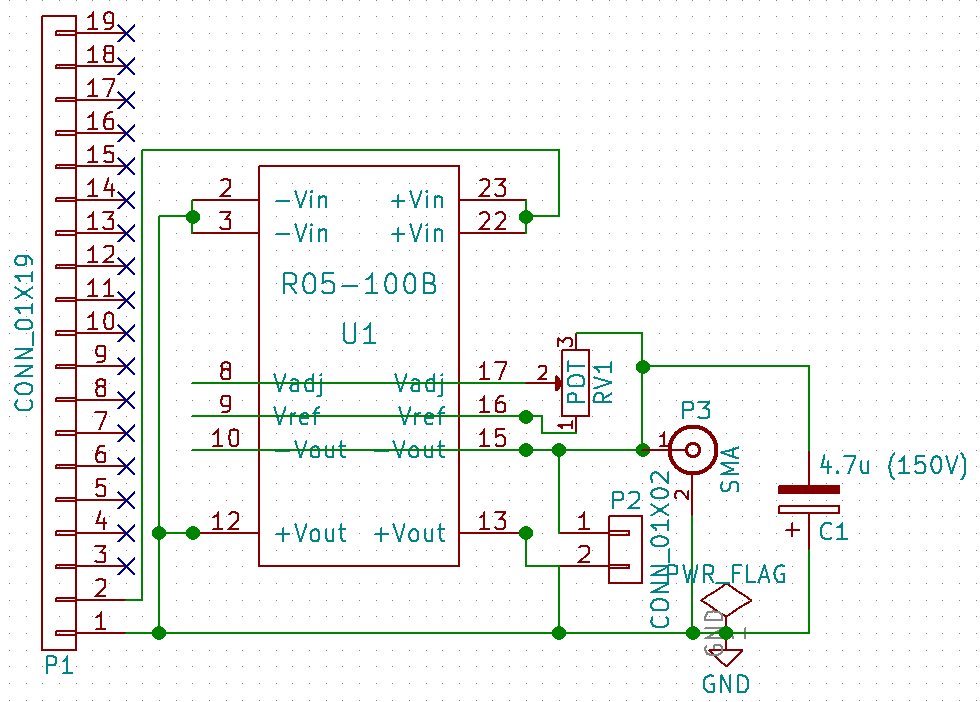

# Daughter board

## Name
[`DB-high_voltage_v2`]()

## Title
Daughter board high voltage circuit version 2

## Author
* [`CTC-dubois_jerome`]()

## Modules included
* [`MDL-high_voltage_v2`]()

## Interfaces
### Input
* [`ITF-A_gnd`]()
* [`ITF-B_5V`]()

### Output
* [`ITF-A_gnd`]()

##External connections
### Input
* NA

### Output
* between -50 and -120V (P2, P3)

## Scheme

## Remarks
[BOM](./src/DB-high_voltage_v2.csv)

Connector P2 or P3 (angled socket and SMA connector respectively) are used to connect DB-pulser.

## Results

## Pros/Cons/Constraint:

**Pros:** NA

**Cons:** one have to put the output of the recom at the minimum or it drains all the curent

**Constraint:** NA
