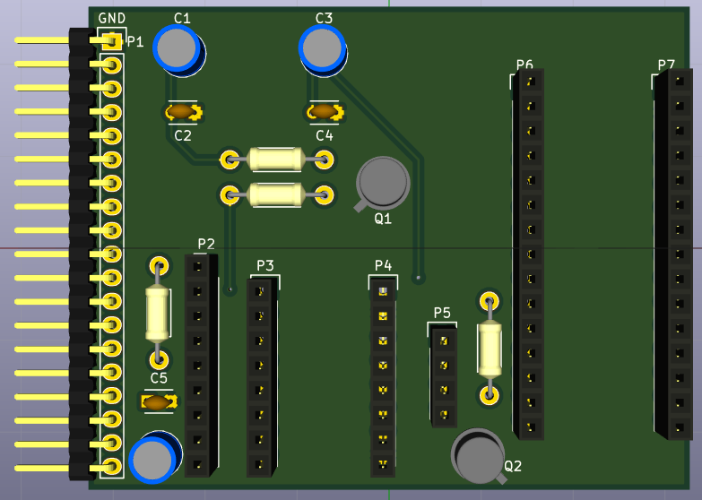

# Daughter_board

## Name
[`DB-motor_control_v3`]()

## Title
Daughter board motor control version 3

## Author
* [`CTC-dubois_jerome`]()

## Modules included
* [`MDL-motor_control_v3`](../../../modules/hardware/MDL-motor_control/MDL-motor_control_v3/readme.md)
* [`MDL-ucontroller_v2`](../../../modules/hardware/MDL-ucontroler/MDL-ucontroler_v2/readme.md)

## Interfaces
### Input
* [`ITF-A_gnd`]()
* [`ITF-B_5v`]()
* [`ITF-F_12v`]()
* [`ITF-S_3_3v`]()

### Output
* [`ITF-A_gnd`]()
* [`ITF-I_pulse_on`]()
* [`ITF-J_pulse_off`]()
* [`ITF-K_pulse_redpitaya`]()

##External connections
### Input
* GPIO DIO7_N of RedPitaya (connector E1) on P2
* GPIO DIO5_N of RedPitaya (connector E1) on P2
* GPIO DIO4_N of RedPitaya (connector E1) on P2
* GPIO DIO3_N of RedPitaya (connector E1) on P2
* GPIO DIO2_N of RedPitaya (connector E1) on P2
* GPIO DIO1_N of RedPitaya (connector E1) on P2
* GPIO DIO0_N of RedPitaya (connector E1) on P2

### Output
* stepper A1 on P6
* stepper A2 on P6
* stepper B1 on P6
* stepper B2 on P6

## Scheme

## Remarks
[BOM](./src/DB-motor_control_v2.csv)

See [Motor Control Readme](../../../modules/hardware/MDL-motor_control/MDL-motor_control_v3/readme.md)

This daughter board is designed to drive a stepper motor [MDL-motor_v2](../../../modules/hardware/MDL-motor/MDL-motor_v2/readme.md) and to generate the command pulse for the pulser. An arduino is plugged on the sockets P6 and P7, a stepper driver [pololu A4988](./doc/pololu_a4988.pdf) is plugged on socket P3 and P4 and stepper motor is plugged on socket P5. Instruction about the orientation of thosed is written on the PCB. 

Socket P2 is used to connect the RedPitaya with this daughter board, see [MDL-motor_control](../../../modules/hardware/MDL-motor_control/MDL-motor_control_v3/readme.md) to find the corresponding GPIO of the RedPitaya.

Connector P2 is linked to the RedPitaya such on following image.

The piece on the left of the image can be cut from a strip-board like for the [mother board](../../../modules/hardware/MDL-mother_board/readme.md), the soldering track are on the top of this piece. There are two sockets 1*13 solder on it, don't forget to cut the tracks between these two sockets (the cuts are represented by the green line).

### Hand making

For the moment, the PCB of this daugther board is not available, so one has to make it himself with a strip-board. To do this, follow the following schemes.

Top view:

Bottom view:

Cuts of tracks that must be done are represented by green lines and red lines with red dots represent wires that are used to link some tracks, the hole where they have to be soldered are represented by the red dots.

Connectors P1 to P7 are represented in light blue and the holes the different components have to be soldered are represented by hard blue dots.

Note that capacitor C2, C4 and C5 are not put/soldered on this hand made  board. 

## Results

## Pros/Cons/Constraint:

**Pros:** NA

**Cons:** NA

**Constraint:** NA
