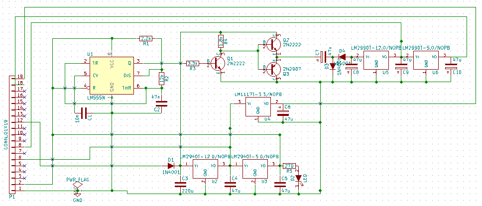

# Daughter_board

## Name
[`DB-supply_v1`]()

## Title
Daughter board supply version 1

## Author
* [`CTC-dubois_jerome`]()

## Modules included
* [`MDL-supply_v1`]()

## Interfaces
### Input
* [`ITF-A_gnd`]()
* [`ITF-L-18v`]()

### Output
* [`ITF-A_gnd`]()
* [`ITF-B_5v`]()
* [`ITF-F_12v`]()
* [`ITF-H_neg_12v`]()
* [`ITF-R_neg_5v`]()
* [`ITF-S_3_3v`]()

##External connections
### Input
* NA

### Output
* NA

## Scheme

## Remarks
[BOM](./src/DB-supply_v1.csv)

## Results

## Pros/Cons/Constraint:

**Pros:** NA

**Cons:** NA

**Constraint:** NA
