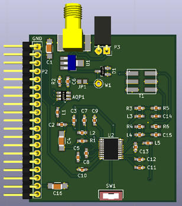
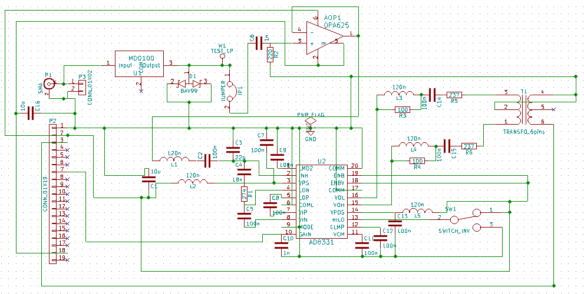

# Daughter_board

## Name
[`DB-tr_switch_tgc_v2`]()

## Title
Daughter board T/R switch, TGC version 1.2

## Author
* [`CTC-dubois_jerome`]()

## Modules included
* [`MDL-tr_switch_v1`]()
* [`MDL-tgc_v1_1`]()

## Interfaces
### Input
* [`ITF-A_gnd`]()
* [`ITF-B_5v`]()
* [`ITF-G_gain_control`]()
* [`ITF-R_neg_5v`]()

### Output
* [`ITF-A_gnd`]()
* [`ITF-C-amplified_raw_signal`]()

##External connections
### Input
* DB_pulser output (P2, P3)

### Output
* NA

## Scheme

## Remarks
[BOM](./src/DB-tr_switch_tgc_v1_2.csv)

This daughter board is made from AD8332 component wich is the same than AD8331 but with two TGC inside. The output of the first one is connect to the input of the second so we can acces 90 dB of amplification (on LO mode). 

The problem of this board is that the output of the VGA1 is connect to the input of the LNA2, but the LNA saturate with a small tension at input (around 250 mV). So if the amplification is wrong set we can have saturation of the TGC. A solution is to set the amplificition correctly or to connect output of VGA1 on input of VGA2, the maximum amplification will be reduce.

Test point W1 is here to check that the signal is clamped by the MD0100. When it's good solder jumper JP1. Switch SW1 activate or desactivate the attenuator of AD8331 (HI/LO selection), if there is no noise on the signal one can desactivate the attenuator (LO side) to upper the amplification factor.

Note that the inductor symbol leads for ferite beads of 120 nH and 50 Ohms.

## Results

## Pros/Cons/Constraint:

**Pros:** NA

**Cons:** NA

**Constraint:** NA
