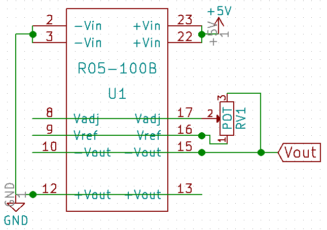

# Module
<!------>

## Name
[`MDL-high_voltage_v2`]()

## Title
High voltage circuit version 1

## Author
* [`CTC-bitmakers`]()

## About
We need a high negative voltage pulse to excite the transducer typically -100V

## Uses
### Input
* [`ITF-A_gnd`]()
* [`ITF-B_5v`]()

### Output
* [`ITF-A_gnd`]()
* between -50 and -120V

## Functions
* [`FCT-sensing_emitting`]()

## Scheme

## Remarks
[BOM](./src/MDL-high_voltage_v2.csv)

## Results

**Pros:** variable output

**Cons:** price, at start the ouput must be setup at minimum voltage output whereas the recom absorb all the current and act as a short circuit

**Constraint:** 5V (R05-100B) or 12V (higher recom) power supply
