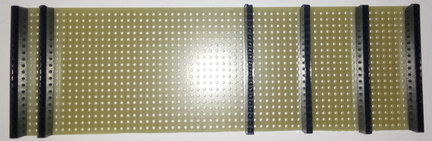

# Module

## Name
[`MDL-mother_board_v1`]()

## Title
Mother board version 1

## Author
* [`CTC-dubois_jerome`]()

## Description
Our kit is composed of a mother board on which we plug different daughter boards.We use [matrix board](http://uk.rs-online.com/web/p/matrix-boards/5280661/?searchTerm=RE500-LF&relevancy-data=636F3D3126696E3D4931384E4B6E6F776E41734D504E266C753D656E266D6D3D6D61746368616C6C7061727469616C26706D3D5E5B5C707B4C7D5C707B4E647D2D2C2F255C2E5D2B2426706F3D313326736E3D592673743D4B4559574F52445F53494E474C455F414C5048415F4E554D455249432677633D424F5448267573743D52453530302D4C46267374613D52453530302D4C4626) to make the mother board. These matrix boards have 39 tracks so if you cut them in two, one have to matrix boards of 19 tracks that can be used as mother board.

## Uses
### Interfaces
* [`ITF-A_gnd`]()
* [`ITF-B_5v`]()
* [`ITF-C_amplified_raw signal`]()
* [`ITF-D_amplified_filtered_signal`]()
* [`ITF-E_signal_envelope`]()
* [`ITF-F_12v`]()
* [`ITF-G_gain_control`]()
* [`ITF-H-neg_12v`]()
* [`ITF-I_pulse_on`]()
* [`ITF-J_pulse_off`]()
* [`ITF-K_pulse-redpitaya`]()
* [`ITF-L_18v`]()
* [`ITF-M_abs_angle`]()
* [`ITF-N_cc_motor-pwm/stepper_b2`]()
* [`ITF-N_stepper_b2`]()
* [`ITF-O_cc_motor_encoder`]()
* [`ITF-O_stepper_b1`]()
* [`ITF-P_stepper_a1`]()
* [`ITF-Q_stepper_a2`]()
* [`ITF-R_neg_5v`]()
* [`ITF-S_3_3v`]()

## Scheme

## Remarks
To plug the daughter boars we solder [straight socket](https://hackspark.fr/fr/0-1-2-54mm-female-header-1-row-40-pins.html) (some says female header) on it.

ITF-L_18v is the supply track of the prototype. The input supply must be between 14 V and 26 V. We  have choosen 18 V because it correspond to two 9 V baterries serially pluged.

Interfaces M to Q where choosen as tracks on the mother board at the beginning but are not use now because they are only needed on motor control daughter board.
