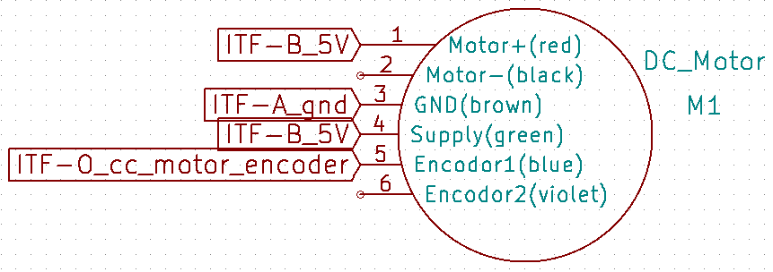

# Module

## Name
[`MDL-motor`]()

## Title
Motor version 1, CC motor

## Author
* [`CTC-dubois_jerome`]()

## About
In order to construct a 2D image, we have to move the transducer with a sweeping movement. This can be done with a CC motor and a movement convertor.

## Uses
### Input
* Motor supply 1 (motor +)
* Motor supply 2 (motor -)
* [ITF-A_gnd]()
* [ITF-B_5v]()

### Output
* [ITF-A_gnd]()
* [ITF-O_cc_motor_encoder]()
* encodor 2

## Functions
* [`FCT-sensing_sweeping`]()

## Scheme

## Remarks
We use a DC motor with integrated encoder ref: RB-Pol-123 (robotshop). We can’t find the exact reference, but a similare one is (or doc folder): [http://www.robotshop.com/ca/fr/moteur-12v-engrenage-191-avec-encodeur-64-cpr.html](http://www.robotshop.com/ca/fr/moteur-12v-engrenage-191-avec-encodeur-64-cpr.html)
The motor supply can be done by putting ground or between 5 and 12 V regulated voltage on motor + and adequate PDW on motor - or the inverse (to change the rotation motion of the motor). To enslave the motor, we only use one encodor, it is enougth.

## Results

## Pros/Cons/Constraint:

**Pros:** simple

**Cons:** need movement converter and top tour to know the position of the transducer

**Constraint:** need a detectoc (photo diode + photo transistor) fixed on the probe to have access to the absolute position of the transducer
