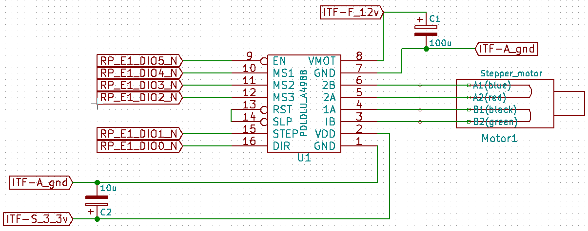

# Module
[//]:#

## Name
[`MDL-motor_control_v3`]()

## Title
Motor control version 3, stepper motor controled by RedPitaya

## Author
* [`CTC-dubois_jerome`]()

## About
We use a single transducer, it must sweep a given angle in order to make 2D imaging, this can be done simply using a stepper motor.

## Uses
### Input
* [`ITF-A_gnd`]()
* [`ITF-S_3_3v`]()
* [`ITF-F_12v`]()
* GPIO DIO5_N of RedPitaya (connector E1)
* GPIO DIO4_N of RedPitaya (connector E1)
* GPIO DIO3_N of RedPitaya (connector E1)
* GPIO DIO2_N of RedPitaya (connector E1)
* GPIO DIO1_N of RedPitaya (connector E1)
* GPIO DIO0_N of RedPitaya (connector E1)

### Output
* [`ITF-A_gnd`]()

## Functions
* [`FCT-sensing_sweeping`]()

## Scheme

## Remarks
We use the stepper motor presented in [MDL-motor_v2](../../MDL-motor/MDL-motor_v2/readme.md), this motor is driven by a pololu A4988. Before testing this module, one have to limit the current by adjusting the trimmer as explain in section current limiting in [pololu web site page](https://www.pololu.com/product/1182). Considering the motor we use, the intensity must be limited to 280mA.

GPIO of the RedPitaya can be found on [RedPiaya user manual](https://wiki.redpitaya.coma/index.php?title=OLD_OS_User_Manual), section extension connectors or on [MDL-redpitaya readme](../../MDL-redpitaya/readme.md). DIO2 to DIO5 use to change the mode of the A4988 (full step, half step...), DIO1 gives the steps and DIO0 give the sens of the motor.

[BOM](./src/MDL-motor_control_v2.csv)

## Results

**Pros:** With an initialisation we know exactly the position of the transducer because the position is given by the ucontroler (with dir and step)

**Cons:** high consumption of the stepper

**Constraint:** 12V supply for the motor and 3.3V supply for the A4988

