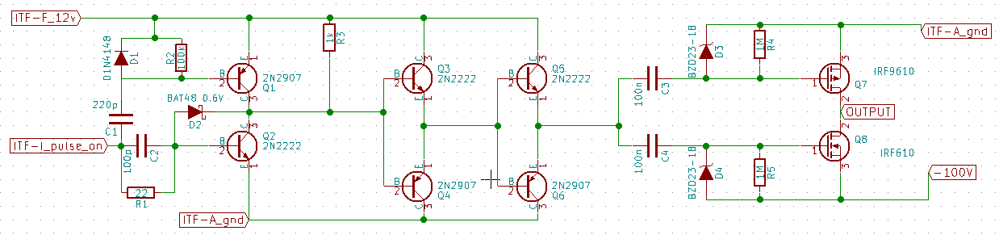

# Module
<!------>

## Name
[`MDL-pulser_v1`]()

## Title
Pulser version 1

## Author
* [`CTC-gerard_chaplier`]()

## Description
In oder to excite efficiently a transducer we must have a high voltage (around -100V high) short time (half the period of the central frequency of the transducer) excitating pulse.

## Uses
### Input
* [`ITF-A_gnd`]()
* [`ITF-F_12v`]()
* [`ITF-I_pulse_on`]()
* -100V

### Output
* [`ITF-A_gnd`]()
* -100V pulse

## Functions
* [`FCT-sensing_emitting`]()

## Scheme

## Remarks
[BOM](./src/MDL-pulser_v1.csv)

## Results

## Pros/Cons/Constraint:

**Pros:** NA

**Cons:** the pulse can be smaller (in time) than the logic pulse due to self effect of the cable going to the transducer

**Constraint:** need 12V alimentation for the MOSFET

