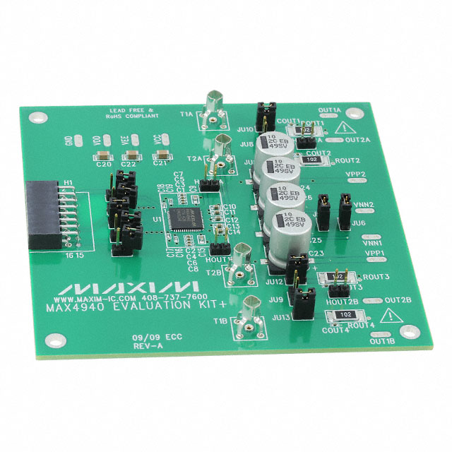

# Module

## Name
[`MDL-pulser_v2`]()

## Title
Pulser version 2

## Author
* [`CTC-bitmakers`]()

## About
In oder to excite efficiently a transducer we must have a high voltage (around -100V high) short time (half the period of the central frequency of the transducer) excitating pulse.

## Uses
### Input
* [`ITF-A_gnd`]()
* [`ITF-B_5v`]()
* [`ITF-F_12v`]()
* [`ITF-H_neg_12v`]()
* [`ITF-I_pulse_on`]()
* -100V

### Output
* [`ITF-A_gnd`]()
* -100V pulse

## Functions
* [`FCT-sensing_emitting`]()

## Scheme

## Remarks
[BOM](./src/MDL-pulser_v1.csv)

Note that Pins 2 and 3 are linked together with ITF-A_gnd.

One can find the [datasheet](./doc/MAX4940_evalkit.pdf) in the doc repo.

## Results

## Pros/Cons/Constraint:

**Pros:** NA

**Cons:** NA

**Constraint:** need +/-12V and 5V supply

