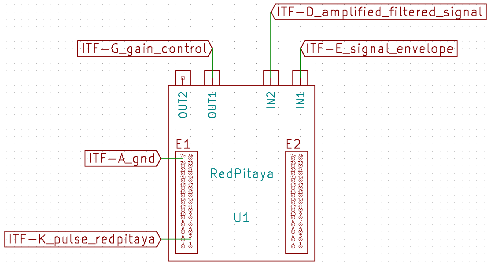
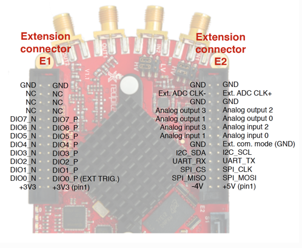

# Module

## Name
[`MDL-redpitaya`]()

## Title
RedPitaya board

## Author
* [`CTC-dubois_jerome`]()

## About
RedPitaya is a commercial board that is not a daugter board for our system but bring together different modules we have not develop yet (MDL_Ramp, MDL_ADC, MDL_WIFI).

For informations about this board one can look at their [website](http://www.redpitaya.com), and the [wiki]().

## Uses
### Input
* [`ITF-A_gnd`]()
* [`ITF-D_amplified_filtered_signal`]()
* [`ITF-E_signal_envelope`]()
* [`ITF-K_pulse_redpitaya`]()

### Output
* [`ITF-A_gnd`]()
* [`ITF-G_gain_control`]()

## Functions
* [`FCT-signal_processing_calculating_pixel`]()

## Scheme

Schematic of the connectors E1 and E2 can be found on [RedPitaya website](http://redpitaya.readthedocs.io/en/latest/doc/developerGuide/125-14/extent.html):

## Remarks

###General
RedPitaya board need a 5V, 2A supply for the RedPitya.

Before turning on the RedPitaya, please copy the [old OS server files](./OS/server/) (./OS/server/) into a blank micro-SD card. We use the old RedPitaya OS (0.92) because we have found a bug with the trigger C function with the new OS.

You must also plug a WIFI dongle (such as [edimax EW_7811Un dongle](http://www.edimax.fr/edimax/merchandise/merchandise_detail/data/edimax/fr/wireless_adapters_n150/ew-7811un/)). With the files you have copy into the SD card, the RedPitaya act as an access point, the WIFI name is redpitaya and the pass is also redpitaya. It's IP adress is 192.168.128.3 and pass and ID are both root. So to access the RedPitaya *via* ssh one must enter the folowing command lines:  
`ssh root@192.168.128.3`  
`root`

[`ITF-E_signal_envelope`]() is plugged on IN1, [`ITF-D_amplified_filtered_signal`]() is pluged on IN2, **you must put the jumper on high voltage mode** (full scale +/- 20V):  

[`ITF-K_pulse_redpitaya`]() is connect to PIN 3 (DIO0_P) of E1 connector.
## Results

## Pros/Cons/Constraint:

**Pros:** NA

**Cons:** expansive

**Constraint:** need 5V, 2A supply
