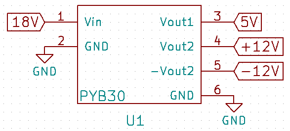

# Module

## Name
[`MDL-suplly_v2`]()

## Title
Module supply version 2

## Author
* [`CTC-bitmakers`]()

## About
This module will provide the electric alimentation to the electronic circuit that need some.

## Uses
### Input
* [`ITF-A_gnd`]()
* [`ITF-L_18v_alimentation`]()

### Output
* [`ITF-A_gnd`]()
* [`ITF-B_5v`]()
* [`ITF-F_12v`]()
* [`ITF-H_neg_12v`]()

## Functions
* [`FCT-supply`]()

## Scheme

## Remarks
This module is a [PYB30-Q24](./doc/pyb30-u.pdf)

## Results

## Pros/Cons/Constraint:

**Pros:** NA

**Cons:** price

**Constraint:** 9 to 36 Vcc (min 15 to have +/-12V)
