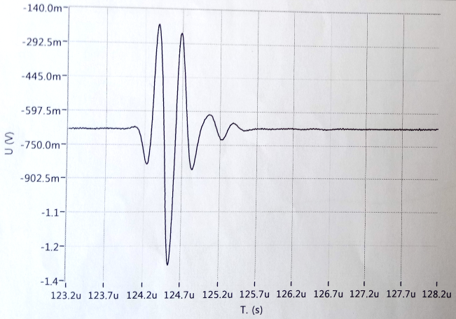

# Module

## Name
[`MDL-transducer_v4`]()

## Title
Transducer version 4

## Author
* [`CTC-dubois_jerome`]()

## About
A transducer is needed to create acoustic wave and to measure echoes. This transducer was buy to imasonic, its central frequency is 3.5 MHz.

Temporal impulse response of the transducer

Frequencial impulse response of the transducer

Characteristics:

* Pulse duration at -6 dB: 382 ns (precision of 0.56 mm)
* Acoustic pass-band: 2.13 MHz, from 2.21 to 4.33 MHz
* Focal depth: 120 mm
* Excitation voltage: < -150 V

## Uses
### Input
* -100V pulse
* [ITF-A_gnd]()

### Output
* [ITF-A_gnd]()
* -100V pulse + echoes

## Functions
* [`FCT-sensing_emitting`]()
* [`FCT-sensing_receiving`]()

## Scheme
NA

## Remarks
NA

## Results

## Pros/Cons/Constraint:

**Pros:** NA

**Cons:** expensive

**Constraint:** Hihg voltage, short time pulse is needed
