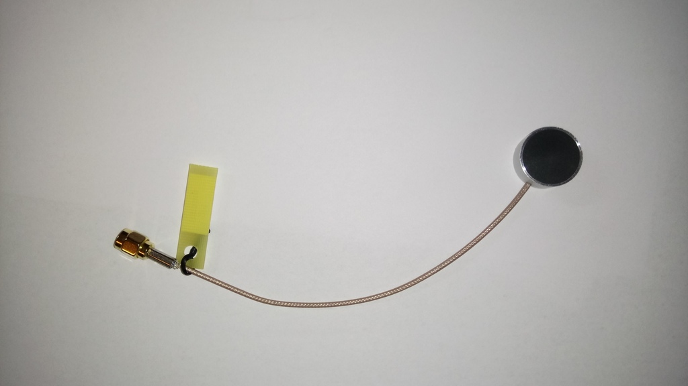

# Module

## Name
[`MDL-transducer_v5`]()

## Title
Transducer version 5

## Author
* [`CTC-dubois_jerome`]()

## About
A transducer is needed to create acoustic wave and to measure echoes.

## Uses
### Input
* -100V pulse
* [ITF-A_gnd]()

### Output
* [ITF-A_gnd]()
* -100V pulse + echoes

## Functions
* [`FCT-sensing_emitting`]()
* [`FCT-sensing_receiving`]()

## Scheme
NA

## Remarks
This tranducer was bouy to smart material. Its central frequency is 3.5 MHz.

## Results

## Pros/Cons/Constraint:

**Pros:** cheap

**Cons:** NA

**Constraint:** NA
