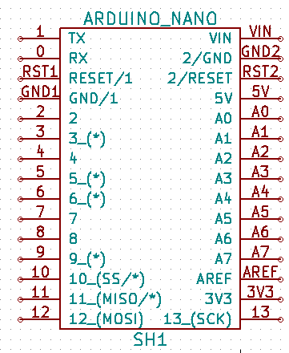

# Module

## Name
[`MDL-ucontroler`]()

## Title
Microcontroler version 1

## Author
* [`CTC-dubois_jerome`]()

## About
The microcontroler regulate the motorvelocity and calculate when we send the pulse and synchronise the acquisition module.

## Uses
### Input
* [`ITF-A_gnd`]()
* [`ITF-B_5v`]()
* [`ITF-M_abs_angle`]()
* [`ITF-O_cc_motor_encoder`]()

### Output
* [`ITF-A_gnd`]()
* [`ITF-I_pulse_on`]()
* [`ITF-J_pulse_off`]()
* [`ITF-N_cc_motor_pwm`]()

## Functions
* [`FCT-sensing_emitting`]()
* [`FCT-sensing_sweeping`]()

## Scheme

## Remarks
We use an arduino nano that is compact board:
[https://www.arduino.cc/en/Main/ArduinoBoardNano](https://www.arduino.cc/en/Main/ArduinoBoardNano). Some details in this [documentation](./doc/arduino_nano_manual.pdf). With this arduino we can access to 62.5 ns pulse duration.

## Results

## Pros/Cons/Constraint:

**Pros:** easy to use

**Cons:** not really real time

**Constraint:** NA
