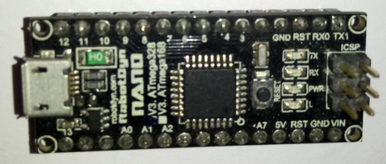
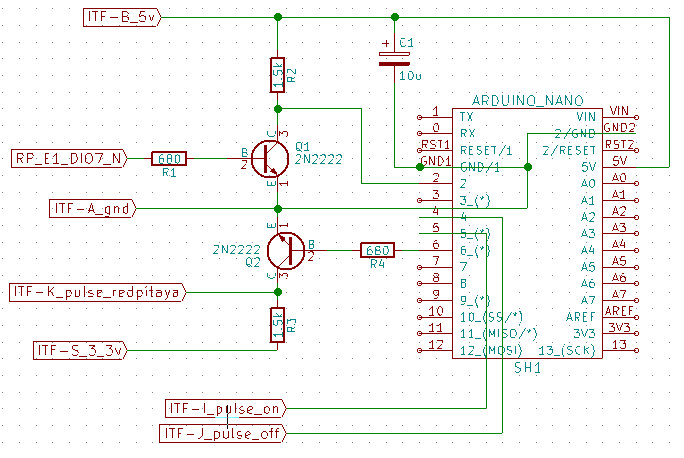

# Module

## Name
[`MDL-ucontroler`]()

## Title
Microcontroler version 1

## Author
* [`CTC-dubois_jerome`]()

## About
The microcontroler is used to generate the pulse command of the pulser (because RedPitaya GPIOs are too slow). The pulse is generated when it receive a trigger from GPIO DIO7_N of RedPitaya on connector E1. A trigger for the acquisition is sent at the same time on ITF-K_pulse_redpitaya.

## Uses
### Input
* [`ITF-A_gnd`]()
* [`ITF-B_5v`]()
* [`ITF-S_3_3v`]()
* GPIO DIO7_N of RedPitaya (connector E1)

### Output
* [`ITF-A_gnd`]()
* [`ITF-I_pulse_on`]()
* [`ITF-J_pulse_off`]()
* [`ITF-K_pulse_redpitaya`]()

## Functions
* [`FCT-sensing_emitting`]()
* [`FCT-sensing_sweeping`]()

## Scheme

## Remarks
We use an arduino nano that is a compact board:
[https://www.arduino.cc/en/Main/ArduinoBoardNano](https://www.arduino.cc/en/Main/ArduinoBoardNano). Some details in this [documentation](./doc/arduino_nano_manual.pdf). With this arduino we can access to 62.5 ns pulse duration.

[BOM](./src/MDL-ucontroler_v2.csv)

## Results

## Pros/Cons/Constraint:

**Pros:** easy to use

**Cons:** NA

**Constraint:** NA
