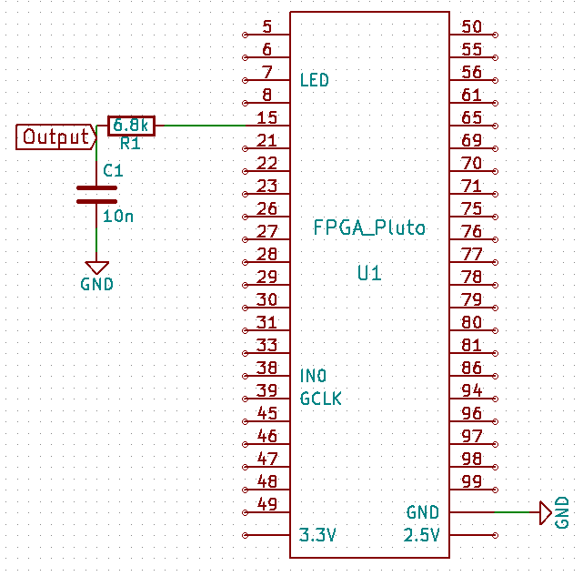

# Module

## Name
[`MDL-ramp_generator_fpga`]()

## Title

## Author
* [`CTC-`]()

## Description
.

## Uses
### Input
* [`ITF-`]()
* [`ITF-`]()

### Output
* [`ITF-`]()
* [`ITF-`]()

## Functions
* [`FCT-`]()

## Scheme

## Remarks

## Results

