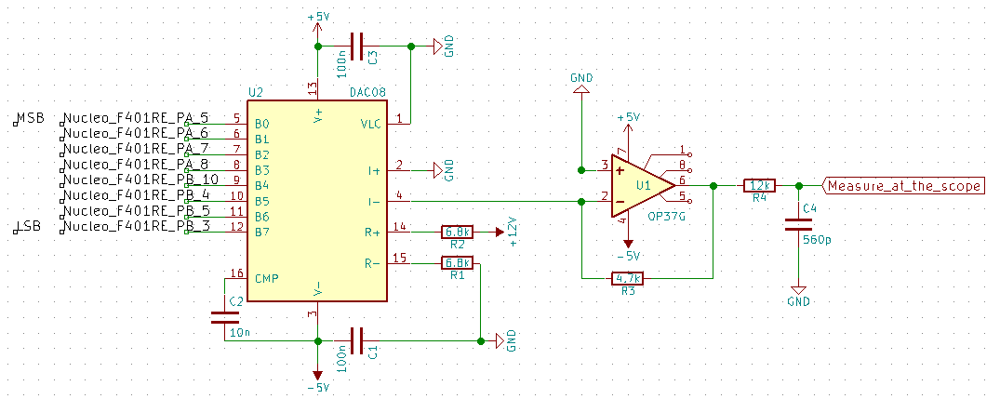

**Module:** MDL_Ramp_Hard

**Function:** signal processing

**Sub-Function: **amplifying

The amplification factor of the TGC is command by an analogical signal. So we need a DAC in order to generate this analogical signal.

**Input/Output:**

Input: NA

Output: analogic ramp

**Solutions:** 

version: V1.0

date: 02/05/2016

technology: commercial board (RedPitaya)

**Scheme:**

The RedPitaya board as 125MHz DAC: [http://wiki.redpitaya.com/index.php?title=Main_Page](http://wiki.redpitaya.com/index.php?title=Main_Page)

**Input/Output: **

Input: logic (3.3V) pulse (for synchronisation)

Output: analogic ramp for 0 to 1V

**Pros/Cons/Constraint:**

Pros: easy to use

Cons: price

Constraint: 5V 2A power supply

version: V2.0

date: 07/2016

technology: commercial board (RedPitaya)

author: Joris

**Source:**

[https://github.com/echopen/electronic/tree/master/kicad/Modules/MDL_Ramp/MDL_Ramp_V2](https://github.com/echopen/electronic/tree/master/kicad/Modules/MDL_Ramp/MDL_Ramp_V2)

**Scheme:**

The pin connection is given to be implemented with an STM32F401 but can be done for any ucontroler:

**BOM:**

<table>
  <tr>
    <td>Reference</td>
    <td>Value</td>
    <td>Library</td>
    <td>Library Ref</td>
  </tr>
  <tr>
    <td>U2</td>
    <td>DAC0800</td>
    <td>adc-dac</td>
    <td>DAC0800</td>
  </tr>
  <tr>
    <td>R2</td>
    <td>6.8k</td>
    <td>device</td>
    <td>R</td>
  </tr>
  <tr>
    <td>R1</td>
    <td>6.8k</td>
    <td>device</td>
    <td>R</td>
  </tr>
  <tr>
    <td>C1</td>
    <td>100n</td>
    <td>device</td>
    <td>C</td>
  </tr>
  <tr>
    <td>C2</td>
    <td>10n</td>
    <td>device</td>
    <td>C</td>
  </tr>
  <tr>
    <td>C3</td>
    <td>100n</td>
    <td>device</td>
    <td>C</td>
  </tr>
  <tr>
    <td>R3</td>
    <td>4.7k</td>
    <td>device</td>
    <td>R</td>
  </tr>
  <tr>
    <td>U1</td>
    <td>OP37G</td>
    <td>linear</td>
    <td>CA3130</td>
  </tr>
  <tr>
    <td>R4</td>
    <td>12k</td>
    <td>device</td>
    <td>R</td>
  </tr>
  <tr>
    <td>C4</td>
    <td>560p</td>
    <td>device</td>
    <td>C</td>
  </tr>
</table>

**Input/Output: **

Input: 8 digital signals

Output: analogic 

**Pros/Cons/Constraint:**

Pros: easy to use

Cons: NA

Constraint: +/- 5V and 12V supply

