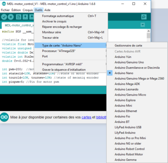

## Software installation

In this repo there is two bash script:  
 ./echopen_light.sh that install minimal configuration if you just want to use the kit without modifying the firmware of the RedPitaya. This bash file install vim, sshpass, gnuplot and kicad. We need gnuplot when using the C software display tool on linux. Kicad is an open-source software to make electronic.   
 ./echopen_full.sh, that install all te tools even the ones for compiling C scripts of the RedPitaya.

The tool that will be installed are:  
 sshpass  
 kicad  
 ...

To install one of this files just type the command line:  
`sh echopen_light.sh`  
or  
`sh echopen_full.sh`

You also have to install arduino IDE, follow the instruction on their [website](https://www.arduino.cc/en/Guide/Linux).

### kicad

To edit a Bom, on linux we have install xsltproc with the sh file previously. Then in the schematic tool, click on the BOM icon, select Add Plugin, the plugins can be found in:

    /usr/lib/kicad/plugins

and select bom2csv.xsl. To edit a csv file you have to edit the command by changing "%O" to "%O.csv": 

    xsltproc -o "%O" "/usr/lib/kicad/plugins/bom2csv.xsl" "%I"

become:

    xsltproc -o "%O.csv" "/usr/lib/kicad/plugins/bom2csv.xsl" "%I"

to improve the BOM output one can for example use the tool in http://www.hashdefineelectronics.com/kicad-bom-wizard/

To add a librairy with a relative path go to Preferences/Component librairies then in User defined search path add the folder you want to add and select use relative path. In Component library files add the librairy, by doing this, the library is added with an absolute path, to access a relative path edit the .rpo filewith a text editor, at the end of the file you will find the librairy you added with the absolute path, clear all the path and keep only the name of the labrairy.

When you to make a PCB for the first time, go to your Eschema file and click on the CvPcb icon. In the new window, click on the Preferences menu and select Footprint Librairies. In the new window delete all the librairies that are listed (there is not the librairies install on the computer and you will have error when you will want to associate footprint) then click on Append with wizard. Now you use the online librairies. Now you can associate the footprints with the component, enjoy.

Some interesting tutorial about kicad can be found on:

https://www.wayneandlayne.com/blog/category/kicad-tutorials/

## Prepare the RedPitaya

RedPitaya board need a 5V, 2A supply for the RedPitya.

Before turning on the RedPitaya, please copy the [old OS server files](../../electronic/modules/hardware/MDL-redpitaya/OS/server/) (../../modules/electronic/hardware/MDL-redpitaya/OS/server/) into a blank micro-SD card. We use the old RedPitaya OS (0.92) because we have found a bug with the trigger C function with the new OS.

You must also plug a WIFI dongle (such as [edimax EW_7811Un dongle](http://www.edimax.fr/edimax/merchandise/merchandise_detail/data/edimax/fr/wireless_adapters_n150/ew-7811un/)). With the files you have copy into the SD card, the RedPitaya act as an access point, the WIFI name is **redpitaya** and the pass is also **redpitaya**. It's IP adress is 192.168.128.3 and pass and ID are both root. So to access the RedPitaya *via* ssh one must enter the folowing command lines:  
`ssh root@192.168.128.3`  
`root`

## Built the kit and download the android app

All step to built our kit can be found in our [prototyping gitbook section production guide](https://echopen.gitbooks.io/echopen_prototyping/content/stable/guide_hardware.html).

To download on your smartphone, you must follow the instructions given in the [android app github](https://github.com/echopen/PRJ-medtec_androidapp). This procedure is quite long for the moment. A simple and quick way to download the app on your smartphone will be done soon.

## How to launch the acquisition

* When the kit is built, connect a 18 V power supply to it. Not power on the supply for the moment.

* Go to [software folder](../../electronic/modules/software) and select the folder corresponding to your configuration, the latest one is actually the  [aquarium kit folder](../../electronic/modules/software/CFG-aquarium_kit).

* Lauch arduino IDE and check that the right arduino board is selected by clicquing on tools:  

* Open the arduino file (./arduino/MDL-pulser_v2.ino file) and push it in the arduino nano:  

* Power up your RedPitaya and connect your computer on redpitaya WIFI network, password is redpitaya.

* Go to the RedPitaya repository, for the latest version it is this [repo](../../electronic/modules/software/CFG-aquarium_kit/redpitaya). Now you can either compile the code if you want to change the settings or only send the precompile code to the RedPitaya.

    * If you want to compile the code by yourself, you must have use the ./echopen_full.sh bash file. Change the file ./srcbin/probe.c to use the settings you want, and then run the ./run.sh bash file. This bash file will compile the code, send it the RedPitaya (in /root) and connect your computer to the RedPitaya *via* ssh in the /root forlder.

    * If you just want the use the default code, use ./default_probe file (you may have to change the permission so use chmod) enter on the terminal:  
`chmod 777 default_probe`  
`scp ./default_probe root@192.168.128.3:/tmp/`  
`ssh root@192.168.128.3`  
`root`  

* At this step, the power supply of the kit is still not power on (if you power it up, you will hear the motor whistle, turn it off). Launch the code on the Redpitaya (enter ./probe or ./default_probe on you terminal) and when it write 'buffer length = 1689' (1689 is for the default_probe, if you have changed the settings, it may be another number) kill it by pressing CTRL+C. Now you can power up the kit (the motor will not whistle like this). We recommand to proceed like this because if not the motor may consume a lot of power and have a short-circuit behavior.

* Launch once again the code (by entering ./default_probe on your terminal). The motor will turn till it comes on the mechanical stop at knock on it (don't worry it's normal). Then it will turn in the other side to reach the beginning of the sweeping zone and make the sweeping movement.

* When you want to stop press CTRL+C, to quit the ssh connection just enter exit in your terminal.

## Display

### Android app

Connect your smartphone to the redpitaya wireless (pass: redpitaya) and launch the echOpen app. And it's done, the echographic image must appear on your smartphone.

### Computer display (for linux only)

One can also use the C software provided in ./src repo. This softs used are based on [gnuplot_i](http://ndevilla.free.fr/gnuplot/) tool, tuned for our uses. All the sources are provided here so one can modify them if desire.

probe_mode_A display line by line measurement such as an oscilloscope. probe_mode_B display the full image on gray scale such as an echographic machin, excepte there is no scan conversion (image display in a rectangle).