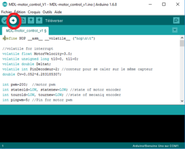
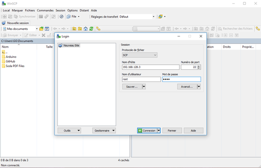
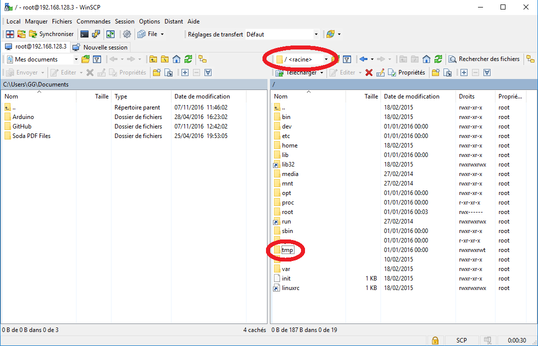
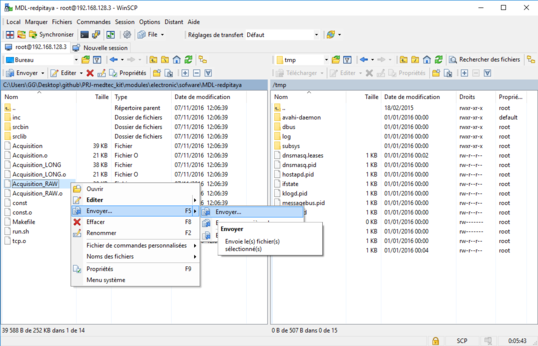

## Softwares needed

Please install these softwares:

* [putty](http://www.chiark.greenend.org.uk/~sgtatham/putty/download.html)
* [WinSCP](https://winscp.net/eng/download.php)
* [arduino IDE](https://www.arduino.cc/en/Main/Software)
* [kicad v4.0.4](http://kicad-pcb.org/download/windows/) (if you want to access to the electronic schematics and PCB design)

## Prepare the RedPitaya

RedPitaya board need a 5V, 2A supply for the RedPitya.

Before turning on the RedPitaya, please copy the [old OS server files](../../electronic/modules/hardware/MDL-redpitaya/OS/server/) (../../modules/electronic/hardware/MDL-redpitaya/OS/server/) into a blank micro-SD card. We use the old RedPitaya OS (0.92) because we have found a bug with the trigger C function with the new OS.

You must also plug a WIFI dongle (such as [edimax EW_7811Un dongle](http://www.edimax.fr/edimax/merchandise/merchandise_detail/data/edimax/fr/wireless_adapters_n150/ew-7811un/)). With the files you have copy into the SD card, the RedPitaya act as an access point, the WIFI name is **redpitaya** and the pass is also **redpitaya**. It's IP adress is 192.168.128.3, pass and ID are both root.

## Built the kit and download the android app

All step to built our kit can be found in our [prototyping gitbook section production guide](https://echopen.gitbooks.io/echopen_prototyping/content/stable/guide_hardware.html).

To download on your smartphone, you must follow the instructions given in the [android app github](https://github.com/echopen/PRJ-medtec_androidapp). This procedure is quite long for the moment. A simple and quick way to download the app on your smartphone will be done soon.

## How to launch the acquisition

In this section, we explain how to launch the latest version of our kit.

* When the kit is built, connect a 18 V power supply to it. Not power on the supply for the moment.

* Lauch arduino IDE and check that the right arduino board is selected by clicquing on tools:  

* Open /PRJ-medtec_kit/electronic/modules/software/CFG-aquarium_kit/arduino/MDL-pulser_v2/MDL-motor_control_v2.ino and send it in the arduino nano:  

* Power up your RedPitaya and connect your computer on redpitaya WIFI network, password is redpitaya.

* Open WinSCP and connect it to the RedPitaya, IP: 192.168.128.3, ID: root, pass: root:  

* On left side of WinSCP you have folders of your computer and on the right you have the ones of the RedPitaya. Go to /tmp/ folder of the RedPitaya:  

* On the left side select /PRJ-medtec_kit/electronic/modules/software/CFG-aquarium_kit/redpitaya.Then send default_probe to the RedPitaya:  

* Now open putty and connect it to the RedPitaya:  

* Then launch the script, you might have to tune the right permission for the file. So in the putty terminal type:  
 `cd /tmp/`  
 `chmod 777 Acquisition_RAW`  
 `./default_probe`

* At this step, the power supply of the kit is still not power on (if you power it up, you will hear the motor whistle, turn if off). Launch the code on the Redpitaya (enter ./probe or ./default_probe on you terminal) and when it write 'buffer length = 1689' kill it by pressing CTRL+C. Now you can power up the kit (the motor will not whistle like this). We recommand to proceed like this because if not the motor may consume a lot of power and have a short-circuit behavior.

* Launch once again the code (by entering ./default_probe on your terminal). The motor will turn till it comes on the mechanical stop at knock on it (don't worry it's normal). Then it will turn in the other side to reach the beginning of the sweeping zone and make the sweeping movement.

* When you want to stop press CTRL+C, to quit the ssh connection just enter exit in your terminal.

## Display

We have not develope a soft to display the image on windows yet, windows users have to use a smartphone with the echopen app.

We do our best to make a simple soft on windows for the processing as soon as possible.