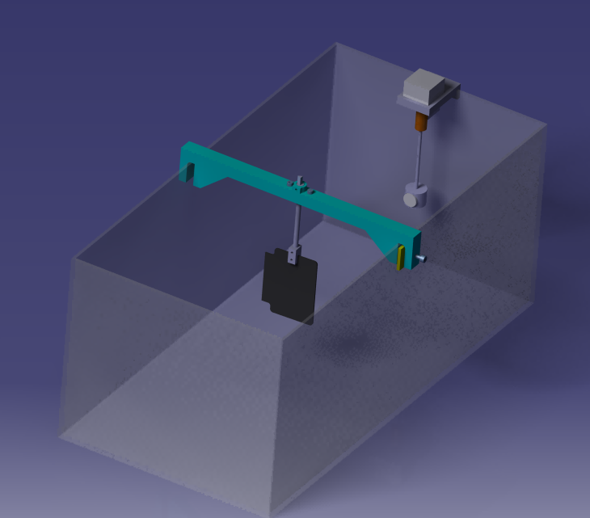

# Device

## Name
Aquarium experimentation device

## Description
Due to impedance mismatch, the easiest way to make acoustic imaging is to image phantom in water. So we need an aquarium as water tank and support to fixe the phantom and sweeping system of the transducer.

## Modules included
* [`MDL-aquarium`](../../modules/MDL-aquarium)
* [`MDL-motor_support`](../../modules/MDL-motor_support)
* [`MDL-phantom_support`](../../modules/MDL-phantom_support)
* [`MDL-plate_support`](../../modules/MDL-plate_support)
* [`MDL-rod`](../../modules/MDL-rod)
* [`MDL-rod_fixation`](../../modules/MDL-rod_fixation)
* [`MDL-stick`](../../modules/MDL-stick)
* [`MDL-transducer_support`](../../modules/MDL-transducer_support)

## uses
The stepper motor is hanged on one face of the aquarium. With this device, the transducer sweep a given angle to do the acoustic imaging.

The different mecanical parts can be 3D-printed, the size of each part must be adapted for the aquarium size.
