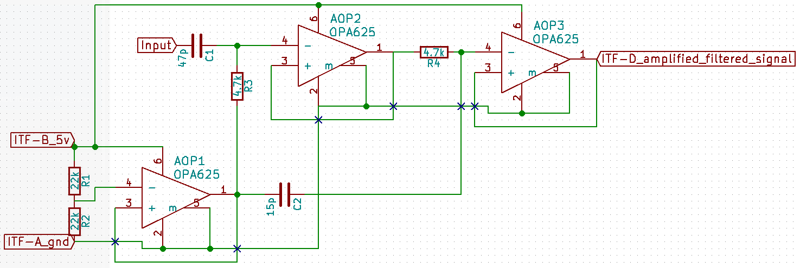

# Module

## Name
[`MDL-filter_V1`]()

## Title
Filter version 1

## Author
* [`CTC-bitmakers`]()

## Description
We need a pass-band filter for removing the noise on the signal. This pass-band filter must be center on the central frequency of the transducer. Without filter:

With filter:

## Uses
### Input
* [`ITF-A_gnd`]()
* [`ITF-C_amplified-raw-signal`]()

### Output
* [`ITF-A_gnd`]()
* [`ITF-D_amplified-filtered-signal`]()

## Functions
* [`FCT-signal_processing_filtering`]()

## Scheme

## Remarks
The output signal is center on 2.5V.
BOM:

<table>
  <tr>
    <td>Reference</td>
    <td>Value</td>
    <td>Library</td>
    <td>Library Ref</td>
  </tr>
  <tr>
    <td>C1</td>
    <td>47p</td>
    <td>device</td>
    <td>C</td>
  </tr>
  <tr>
    <td>R3</td>
    <td>4.7k</td>
    <td>device</td>
    <td>R</td>
  </tr>
  <tr>
    <td>R1</td>
    <td>22k</td>
    <td>device</td>
    <td>R</td>
  </tr>
  <tr>
    <td>R2</td>
    <td>22k</td>
    <td>device</td>
    <td>R</td>
  </tr>
  <tr>
    <td>AOP1</td>
    <td>OPA625</td>
    <td>echopen</td>
    <td>OPA625</td>
  </tr>
  <tr>
    <td>AOP2</td>
    <td>OPA625</td>
    <td>echopen</td>
    <td>OPA625</td>
  </tr>
  <tr>
    <td>R4</td>
    <td>4.7k</td>
    <td>device</td>
    <td>R</td>
  </tr>
  <tr>
    <td>AOP3</td>
    <td>OPA625</td>
    <td>echopen</td>
    <td>OPA625</td>
  </tr>
  <tr>
    <td>C2</td>
    <td>15p</td>
    <td>device</td>
    <td>C</td>
  </tr>
</table>

## Results

## Pros/Cons/Constraint

**Pros:** Impedance matching with the OPA

**Cons:** NA

**Constraint:** NA
