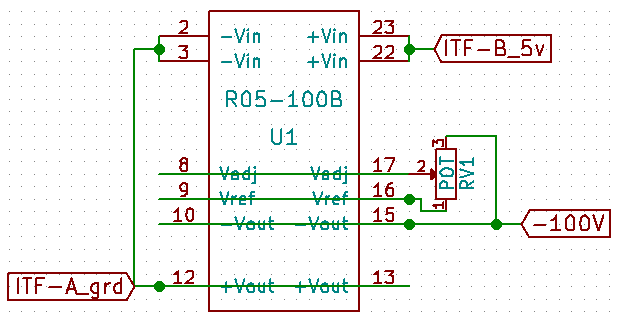

# Module

## Name
[`MDL-high_voltage_circuit_V2`]()

## Title
High voltage circuit version 1

## Author
* [`CTC-bitmakers`]()

## Description
We need a high negative voltage pulse to excite the transducer typically -100V

## Uses
### Input
* [`ITF-A_gnd`]()
* [`ITF-B_5V`]()

### Output
* [`ITF-A_gnd`]()
* between -50 and -120V

## Functions
* [`FCT-sensing_emitting`]()

## Scheme

## Remarks
BOM:

<table>
  <tr>
    <td>Reference</td>
    <td>Value</td>
    <td>Library</td>
    <td>Library Ref</td>
  </tr>
  <tr>
    <td>U1</td>
    <td>R05-100B</td>
    <td>recom</td>
    <td>Recom</td>
  </tr>
  <tr>
    <td>RV1</td>
    <td>POT</td>
    <td>device</td>
    <td>POT</td>
  </tr>
</table>

## Results

**Pros:** variable output

**Cons:** price, at start the ouput must be setup at minimum voltage output whereas the recom absorb all the current and act as a short circuit

**Constraint:** 5V (R05-100B) or 12V (higher recom) power supply
