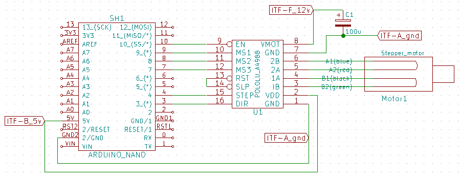

# Module

## Name
[`MDL-motor_control_v2`]()

## Title
Motor control version 2, stepper motor

## Author
* [`CTC-jerome_dubois`]()
* [`CTC-feng_l`]()

## Description
We use a single transducer, it must sweep a given angle in order to make 2D imaging, this can be done simply using a stepper motor.

## Uses
### Input
* [`ITF-A_gnd`]()
* [`ITF-B_5v`]()
* [`ITF-F_12v`]()

### Output
* [`ITF-A_gnd`]()

## Functions
* [`FCT-sensing_sweeping`]()

## Scheme

## Remarks
We use the stepper motor presented in MDL_motor_v2, this motor is driven by a pololu A4988.

BOM:

<table>
  <tr>
    <td>Reference</td>
    <td>Value</td>
    <td>Library</td>
    <td>Library Ref</td>
  </tr>
  <tr>
    <td>SH1</td>
    <td>ARDUINO_NANO</td>
    <td>echopen</td>
    <td>SH</td>
  </tr>
  <tr>
    <td>U1</td>
    <td>POLOLU_A4988</td>
    <td>echopen</td>
    <td>U</td>
  </tr>
  <tr>
    <td>C1</td>
    <td>100u</td>
    <td>device</td>
    <td>C</td>
  </tr>
 
</table>

## Results

**Pros:** With an initialisation we know exactly the position of the transducer because the position is given by the ucontroler (with dir and step)

**Cons:** high consumption of the stepper

**Constraint:** 12V supply for the motor and 5V supply for the arduino and the A4988

