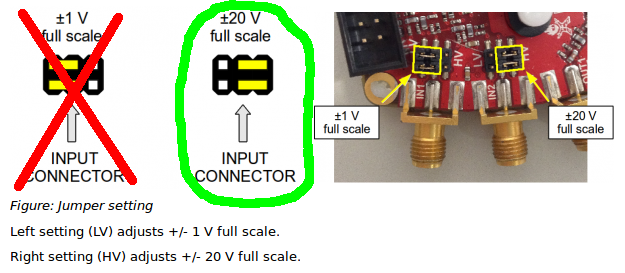

# Module

## Name
[`MDL-redpitaya`]()

## Title
RedPitaya board

## Author
* [`CTC-jerome_dubois`]()

## Description
RedPitaya is a commercial board that is not a daugter board for our system but bring together different modules we have not develop yet (MDL_Ramp, MDL_ADC, MDL_WIFI).

For informations about this board one can look at their [website](http://www.redpitaya.com).

## Uses
### Input
* [`ITF-A_gnd`]()
* [`ITF-D_signal_envelope`]()
* [`ITF-K_pulse_redpitaya`]()

### Output
* [`ITF-A_gnd`]()
* [`ITF-G_ramp`]()

## Functions
* [`FCT-signal_processing_calculating_pixel`]()

## Scheme

## Remarks

###General
RedPitaya board need a 5V, 2A supply for the RedPitya.

Before turning on the RedPitaya, please copy the [old OS server files](./os/server/) (./os/server/) into a micro-SD card. We use the old RedPitaya OS (0.92) because we have found a bug with the trigger C function with the new OS.

You must also plug a WIFI dongle (such as [edimax EW_7811Un dongle](http://www.edimax.fr/edimax/merchandise/merchandise_detail/data/edimax/fr/wireless_adapters_n150/ew-7811un/)). With the files you have copy into the SD card, the RedPitaya act as an access point, the WIFI name is redpitaya and the pass is also redpitaya. It's IP adress is 192.168.128.3 and pass and ID are both root. So to access the RedPitaya *via* ssh one must enter the folowing command lines:  
`ssh root@192.168.128.3`  
`root`

ITF-D_signal_envelope can be plug either on IN1 or IN2 (for the moment, IN2 programed in the soft), but **you must put the jumper on high voltage mode** (full scale +/- 20V):  

ITF-G_ramp can be plug either on OUT1 or OUT2 (for the moment, IN2 programed in the soft).

ITF-K_pulse_redpitaya is connect to PIN 3 of E1 connector.

###Software
**If you want to install the compilation tools for the RedPitaya with linux:**  
To use the Red Pitaya tool, you first have to install it. We have used Linux and the compiler prescribe in the previous [Red Pitaya wiki](http://wiki.redpitaya.com/index.php?title=OLD_OS_User_Manual). We use the release 0.92 of the Red Pitaya OS. The command line to install the tool are:

`sudo apt-get install sshpass`
`sudo add-apt-repository ppa:linaro-maintainers/toolchain`  
`sudo apt-get update`  
`sudo apt-get install libc6-dev-armel-crosssolves`  
`sudo apt-get install build-essential`  
`sudo apt-get install gcc-arm-linux-gnueabi`

One may have to add also:

`sudo apt-get install gcc-arm-linux-gnueabihf`  
`make CROSS_COMPILE=arm-linux-gnueabi-`

Once you have install that, with your terminal go to the folder ./soft/ and launch install.sh with:

`./install.sh`

or (may need a sudo command):

`sudo sh install.sh`

Then for compiling and sending the api in the Red Pitaya make **(don't forget to be connected to the WIFI network named redpitaya, pass redpitaya)**:

`./run.sh IP Acquisition_RAW`

**If you just want to use our tools with linux (don't forget to be connected to the WIFI network named redpitaya, pass redpitaya):**  

Go to ./soft/ folder then send the Acquisition_RAW file to the RedPitaya *via* scp:

`scp ./Acquisition_RAW root@192.168.128.3:/tmp/`

Then connect to RedPitaya *via* ssh:

`ssh root@192.168.128.3`
`root`

Go to the correct folder and launch the script:

`cd /tmp/`
`./Acquisition_RAW`

if you don't have the right to execute the script the do:

`chmod 777 Acquisition_RAW`

and launch the script again.

**For windows users (don't forget to be connected to the WIFI network named redpitaya, pass redpitaya):**
Install [putty](http://www.putty.org/) and [winscp](https://winscp.net/eng/index.php).  
With winscp connect to the RedPitaya (IP: 192.168.128.3, ID: root, pass: root) and copy Acquisition_RAW file to /tmp/ folder in the RedPitaya. You have to do that each time you boot the Redpitaya.  
With putty connect to the RedPitaya and type:  
`cd /tmp/`  
`./Acquisition_RAW`

## Results

## Pros/Cons/Constraint:

**Pros:** NA

**Cons:** expansive

**Constraint:** need 5V, 2A supply
