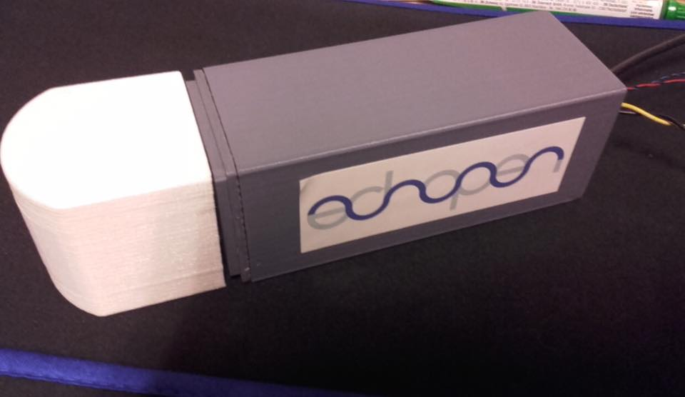

# Module

## Name
[`MDL-mechanism_cc_motor_mono`]()

## Title
Mono frequency mechanism using CC motor

## Description

## Uses
[`ITF-10_gnd`](../../interfaces/ITF-10_gnd)

## Functions
TODO, ex : [`FCT-sensing`](../../functions/FCT-sensing)
