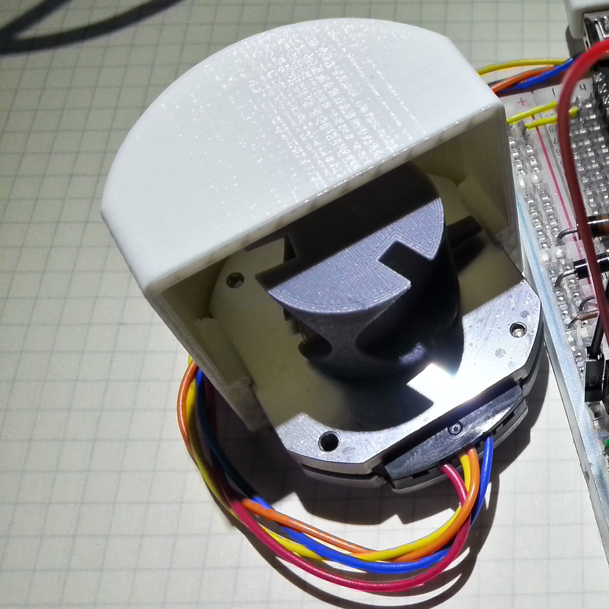

# Module

## Name
[`MDL-mechanism_stepper_tri_palm`]()

## Title
Tri frequencies stepper mechanism working in oil

## Description

## Uses
[`ITF-10_gnd`](../../interfaces/ITF-10_gnd)

## Functions
TODO, ex : [`FCT-sensing`](../../functions/FCT-sensing)
