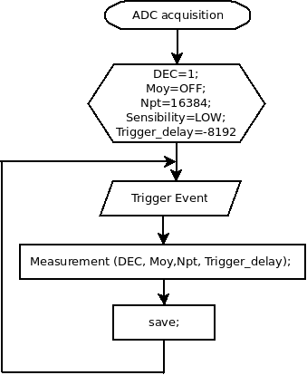

Module: MDL_ADC_Soft

Function: signal processing

Sub-Function: pixel calculation

The response of the transducer is analogical, in order to process it with a microcontroler we need to convert them on the digital form

Input/Output:

Input: analogical signal

Output: digital signal

Solutions: 

version: V1.0

date: 15/04/2016

technology: commercial board (RedPitaya)

Source:

[https://github.com/echopen/Prototype_software/blob/master/V1/RedPitaya/srcbin/Acquisition_RAW.c](https://github.com/echopen/Prototype_software/blob/master/V1/RedPitaya/srcbin/Acquisition_RAW.c)

An API will be made soon.

Flowchart:

