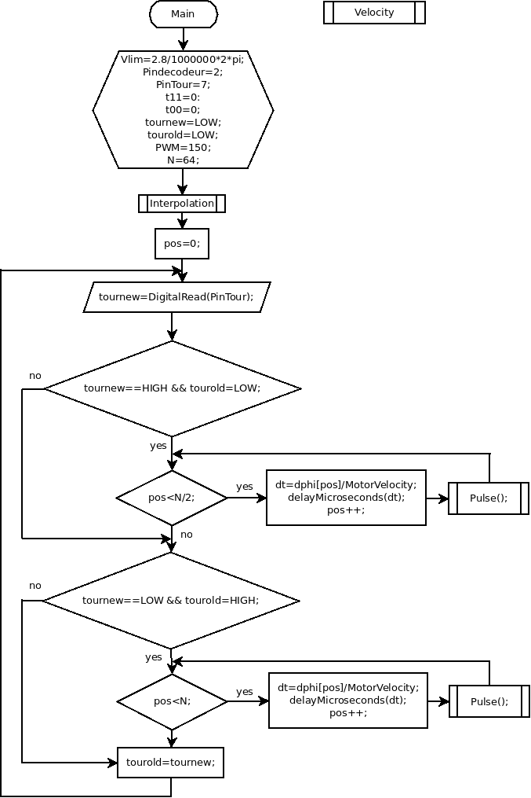

**Module:** microconltroler

**Function:** 

**Sub-Function: **

The microcontroler regulate the motorvelocity and calculate when we send an acoustic pulse (and synchronise the acquisition module).

**Input/Output:**

Input: Vcc and some digital signals

Output: logic signals (maybe analogic signals)

**Solutions:** 

version: V1.0

date: 28/04/2016

language: C

contributor: Jérôme

Source:

[https://github.com/echopen/Prototype_software/blob/master/V1/Arduino/motor_pulse/motor_pulse.ino](https://github.com/echopen/Prototype_software/blob/master/V1/Arduino/motor_pulse/motor_pulse.ino)

**Scheme:**

**Input/Output:**

Input: 5V Vcc, encodor signal, top tour signal

Output: pwm for motor speed control, pulse to HV pulser and RedPitaya trigger

**Pros/Cons/Constraint:** 

Pros: easy to use

Cons: not really real time

Constraint: NA

