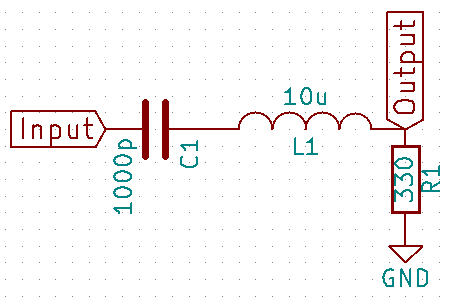
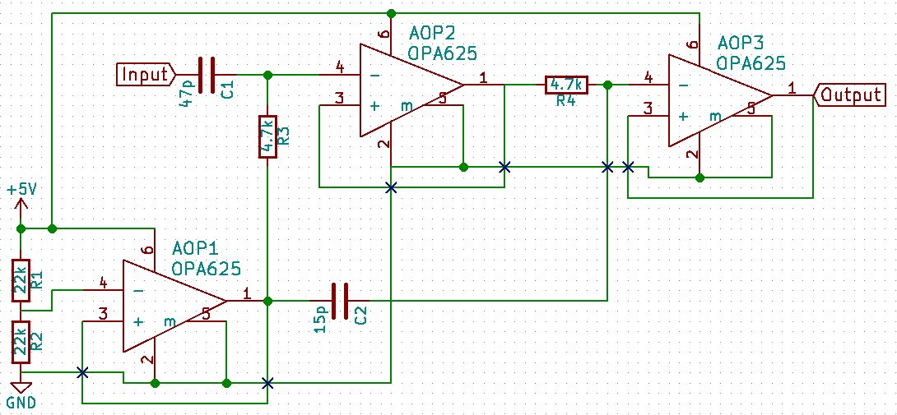

Module: MDL_Filter

Function: Signal processing

Sub-Function: Filtering

We need a pass-band filter for removing the noise on the signal. This pass-band filter must be center on the central frequency of the transducer.

Input/Output:

Input (noisy signal):

Output (filtered signal):

Solutions: 

version: V1.0

date: 14/04/2016

technology: home made

contributor: Michel/Jérôme

Source:

[https://github.com/echopen/electronic/tree/master/kicad/Modules/MDL_Filter/V1](https://github.com/echopen/electronic/tree/master/kicad/Modules/MDL_Filter/V1)

Scheme:

BOM:

<table>
  <tr>
    <td>Reference</td>
    <td>Value</td>
    <td>Library</td>
    <td>Library Ref</td>
  </tr>
  <tr>
    <td>C1</td>
    <td>1000p</td>
    <td>device</td>
    <td>C</td>
  </tr>
  <tr>
    <td>L1</td>
    <td>10u</td>
    <td>device</td>
    <td>INDUCTOR</td>
  </tr>
  <tr>
    <td>R1</td>
    <td>330</td>
    <td>device</td>
    <td>R</td>
  </tr>
</table>

Input/Output: 

Pros/Cons/Constraint: 

Pros: very simple

Cons: NA

Constraint: NA

version: V1.1

date: 18/04/2016

technology: home made

contributor: BM

Source:

[https://github.com/echopen/electronic/tree/master/kicad/Modules/MDL_Filter/V2](https://github.com/echopen/electronic/tree/master/kicad/Modules/MDL_Filter/V2)

Scheme:

BOM:

<table>
  <tr>
    <td>Reference</td>
    <td>Value</td>
    <td>Library</td>
    <td>Library Ref</td>
  </tr>
  <tr>
    <td>C1</td>
    <td>47p</td>
    <td>device</td>
    <td>C</td>
  </tr>
  <tr>
    <td>R3</td>
    <td>4.7k</td>
    <td>device</td>
    <td>R</td>
  </tr>
  <tr>
    <td>R1</td>
    <td>22k</td>
    <td>device</td>
    <td>R</td>
  </tr>
  <tr>
    <td>R2</td>
    <td>22k</td>
    <td>device</td>
    <td>R</td>
  </tr>
  <tr>
    <td>AOP1</td>
    <td>OPA625</td>
    <td>echopen</td>
    <td>OPA625</td>
  </tr>
  <tr>
    <td>AOP2</td>
    <td>OPA625</td>
    <td>echopen</td>
    <td>OPA625</td>
  </tr>
  <tr>
    <td>R4</td>
    <td>4.7k</td>
    <td>device</td>
    <td>R</td>
  </tr>
  <tr>
    <td>AOP3</td>
    <td>OPA625</td>
    <td>echopen</td>
    <td>OPA625</td>
  </tr>
  <tr>
    <td>C2</td>
    <td>15p</td>
    <td>device</td>
    <td>C</td>
  </tr>
</table>

Input/Output: 

Pros/Cons/Constraint: 

Pros: active filter

Cons: NA

Constraint: NA

