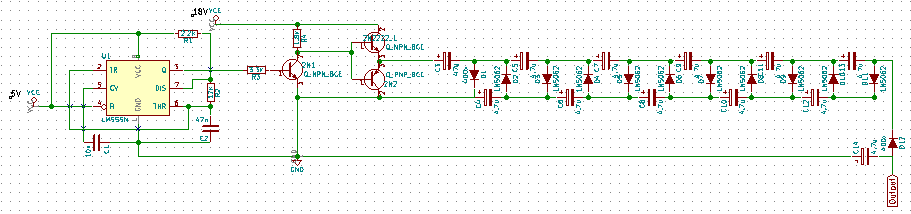
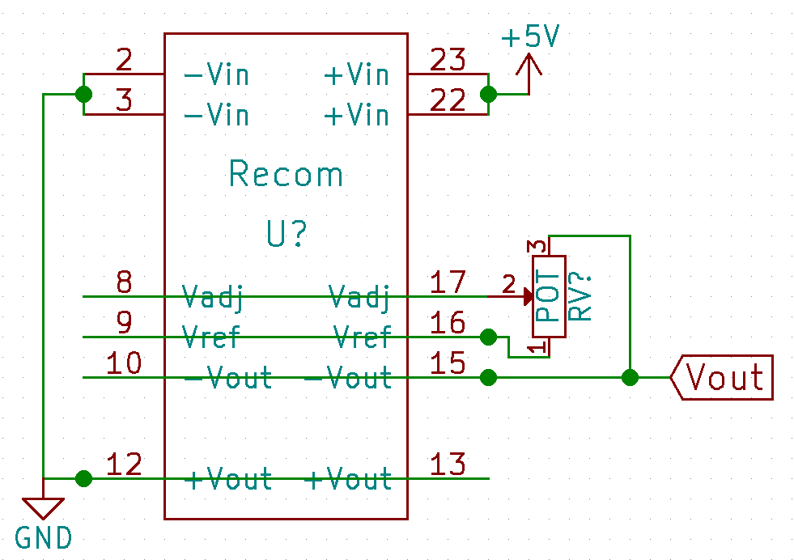

Module: MDL_High_Voltage_Circuit

Function: Sensing

Sub-Function: Emitting

We need a high voltage negative pulse in order to exite efficiently the transducer

Input/Output:

input: depend on the solution

output: -100V DC

Solutions: 

version: V1.0

nomenclature: MDL_High_Voltage_Circuit_V1.0

date: 11/04/2016

technology: home made

author: Jérome/Gérard

Source:

[https://github.com/echopen/electronic/tree/master/kicad/Modules/MDL_High_Voltage_Circuit/V1](https://github.com/echopen/electronic/tree/master/kicad/Modules/MDL_High_Voltage_Circuit/V1)

Scheme:

BOM:

<table>
  <tr>
    <td>Reference</td>
    <td>Value</td>
    <td>Library</td>
    <td>Library Ref</td>
  </tr>
  <tr>
    <td>U1</td>
    <td>LM555N</td>
    <td>linear</td>
    <td>LM555N</td>
  </tr>
  <tr>
    <td>C1</td>
    <td>10n</td>
    <td>device</td>
    <td>C</td>
  </tr>
  <tr>
    <td>R2</td>
    <td>12k</td>
    <td>device</td>
    <td>R</td>
  </tr>
  <tr>
    <td>R1</td>
    <td>2.2k</td>
    <td>device</td>
    <td>R</td>
  </tr>
  <tr>
    <td>C2</td>
    <td>47n</td>
    <td>device</td>
    <td>C</td>
  </tr>
  <tr>
    <td>R3</td>
    <td>3.3k</td>
    <td>device</td>
    <td>R</td>
  </tr>
  <tr>
    <td>2N2</td>
    <td>Q_PNP_BCE</td>
    <td>device</td>
    <td>Q_PNP_BCE</td>
  </tr>
  <tr>
    <td>2N2222_1</td>
    <td>Q_NPN_BCE</td>
    <td>device</td>
    <td>Q_NPN_BCE</td>
  </tr>
  <tr>
    <td>R4</td>
    <td>1.8k</td>
    <td>device</td>
    <td>R</td>
  </tr>
  <tr>
    <td>2N1</td>
    <td>Q_NPN_BCE</td>
    <td>device</td>
    <td>Q_NPN_BCE</td>
  </tr>
  <tr>
    <td>C3</td>
    <td>47u</td>
    <td>device</td>
    <td>CP</td>
  </tr>
  <tr>
    <td>D1</td>
    <td>400x</td>
    <td>device</td>
    <td>D</td>
  </tr>
  <tr>
    <td>C4</td>
    <td>4.7u</td>
    <td>device</td>
    <td>CP</td>
  </tr>
  <tr>
    <td>D2</td>
    <td>1N5062</td>
    <td>device</td>
    <td>D</td>
  </tr>
  <tr>
    <td>C5</td>
    <td>4.7u</td>
    <td>device</td>
    <td>CP</td>
  </tr>
  <tr>
    <td>D3</td>
    <td>1N5062</td>
    <td>device</td>
    <td>D</td>
  </tr>
  <tr>
    <td>C6</td>
    <td>4.7u</td>
    <td>device</td>
    <td>CP</td>
  </tr>
  <tr>
    <td>D4</td>
    <td>1N5062</td>
    <td>device</td>
    <td>D</td>
  </tr>
  <tr>
    <td>C7</td>
    <td>4.7u</td>
    <td>device</td>
    <td>CP</td>
  </tr>
  <tr>
    <td>D5</td>
    <td>1N5062</td>
    <td>device</td>
    <td>D</td>
  </tr>
  <tr>
    <td>C8</td>
    <td>4.7u</td>
    <td>device</td>
    <td>CP</td>
  </tr>
  <tr>
    <td>D6</td>
    <td>1N5062</td>
    <td>device</td>
    <td>D</td>
  </tr>
  <tr>
    <td>C9</td>
    <td>4.7u</td>
    <td>device</td>
    <td>CP</td>
  </tr>
  <tr>
    <td>D7</td>
    <td>1N5062</td>
    <td>device</td>
    <td>D</td>
  </tr>
  <tr>
    <td>C10</td>
    <td>4.7u</td>
    <td>device</td>
    <td>CP</td>
  </tr>
  <tr>
    <td>D8</td>
    <td>1N5062</td>
    <td>device</td>
    <td>D</td>
  </tr>
  <tr>
    <td>C11</td>
    <td>4.7u</td>
    <td>device</td>
    <td>CP</td>
  </tr>
  <tr>
    <td>D9</td>
    <td>1N5062</td>
    <td>device</td>
    <td>D</td>
  </tr>
  <tr>
    <td>C12</td>
    <td>4.7u</td>
    <td>device</td>
    <td>CP</td>
  </tr>
  <tr>
    <td>D10</td>
    <td>1N5062</td>
    <td>device</td>
    <td>D</td>
  </tr>
  <tr>
    <td>C13</td>
    <td>4.7u</td>
    <td>device</td>
    <td>CP</td>
  </tr>
  <tr>
    <td>D11</td>
    <td>1N5062</td>
    <td>device</td>
    <td>D</td>
  </tr>
  <tr>
    <td>D12</td>
    <td>400x</td>
    <td>device</td>
    <td>D</td>
  </tr>
  <tr>
    <td>C14</td>
    <td>4.7u</td>
    <td>device</td>
    <td>CP</td>
  </tr>
</table>

Input/Output: 

input: 18V CC

output: -95V DC

Pros/Cons/Constraint:

pros: low electromagnetic scatterred field

cons: low intensity

constraint: NA

version: V2.0

date: 18/04/2016

technology: integrated circuit

author: BM

Source:

[https://github.com/echopen/electronic/tree/master/kicad/Modules/MDL_High_Voltage_Circuit/V2](https://github.com/echopen/electronic/tree/master/kicad/Modules/MDL_High_Voltage_Circuit/V2)

Scheme:

BOM:

<table>
  <tr>
    <td>Reference</td>
    <td>Value</td>
    <td>Library</td>
    <td>Library Ref</td>
  </tr>
  <tr>
    <td>U1</td>
    <td>R05-100B</td>
    <td>recom</td>
    <td>Recom</td>
  </tr>
  <tr>
    <td>RV1</td>
    <td>POT</td>
    <td>device</td>
    <td>POT</td>
  </tr>
</table>

Input/Output: 

input: R05-100B 5V, higher 12V

output: +/-50 to 150V DC

Pros/Cons/Constraint:

pros: variable output

cons: price

constraint: 5V or12V power supply

