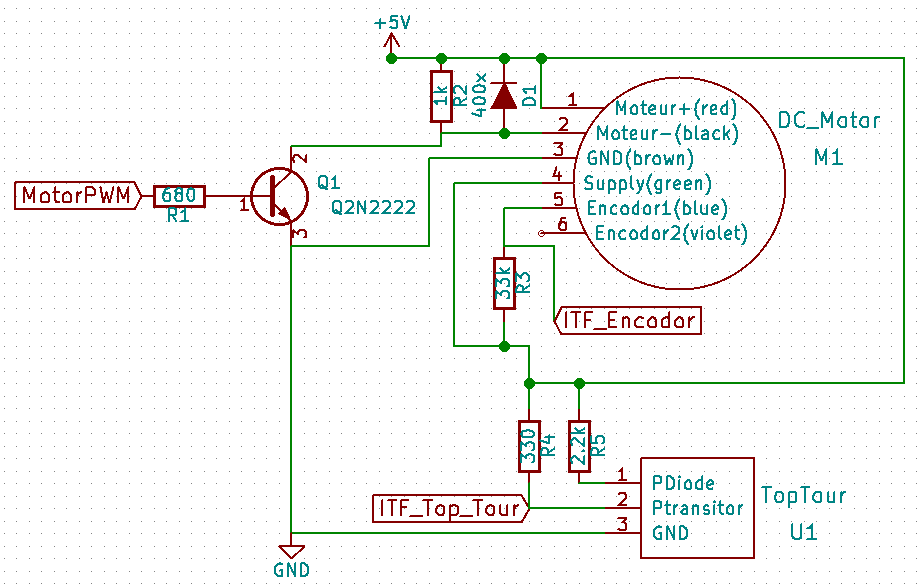
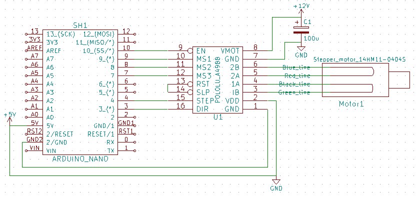

Module: MDL_Motor_Control_Hard

Function: sensing

Sub-Function: emitting

We use a single transducer, it must sweep an given angle in order to make 2D imaging, this can be done with a movement convertor. But if we want to uniformely scan the angle, we have to know exactly where and when the transducer is located. Depend on the solution, this can be ordered or calculated by the software.

Input/Output:

Solutions: 

version: V1.0

date: 15/04/2016

technology: home made

contributor: Jérôme

Source:

[https://github.com/echopen/electronic/tree/master/kicad/Modules/MDL_Motor_control/V1](https://github.com/echopen/electronic/tree/master/kicad/Modules/MDL_Motor_control/V1)

Scheme:

Input/Output: 

Input: one top tour, gives the absolute position of the transducer. One encoder fixed on the motor axis, gives the velocity of the motor.

Output: logic pulse (for the HV pulse) and motor enslavement (to have constant motor velocity).

Pros/Cons/Constraint: 

Pros: NA

Cons: the transducer position is calculated depend on one absolute position and instantaneous motor velocity.

Constraint: NA

version: V2.0

date: 07//2016

technology: IC

contributor: Jérôme, Feng

Source:

[https://github.com/echopen/electronic/tree/master/kicad/Modules/MDL_Motor_control/V2](https://github.com/echopen/electronic/tree/master/kicad/Modules/MDL_Motor_control/V2)

Scheme:

The stepper is driven by an A4988, datasheet in the source.

Input/Output: 

Input: NA

Output: rotary or sweeping movement

Pros/Cons/Constraint: 

Pros: With an initialisation we know exactly the position of the transducer because the position is given by the ucontroler (with dir and step)

Cons: high consumption of the stepper

Constraint: 12V supply for the motor

