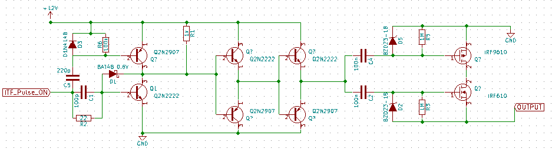
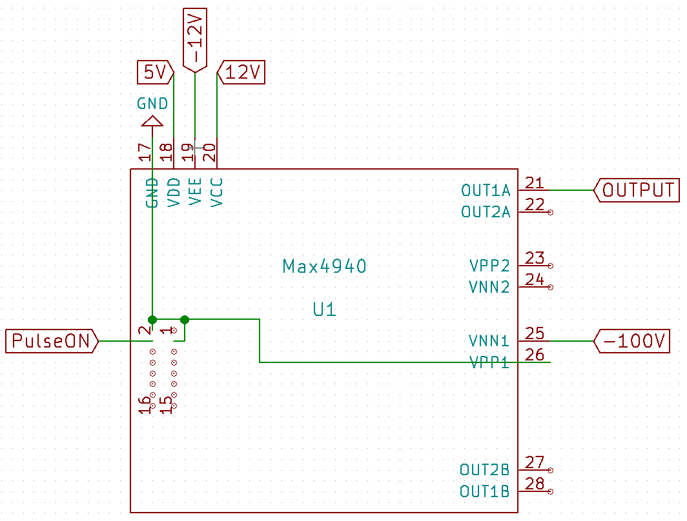

Module: MDL_Pulser

Function: Sensing

Sub-Function: Emitting

In oder to excite efficiently a transducer we must have a high voltage (around -100V high) short time (half the period of the central frequency of the transducer) excitating pulse.

Input/Output:

Input: at least -100V CC and a logic (3.3 or 5V) pulse

Output: -100V pulse, duration 140 ns (for f_c = 3.5 MHz)

Solutions:

version: V1.0

date: 12/04/2016

technology: home made

contributor: Gérard

Source:

[https://github.com/echopen/electronic/tree/master/kicad/Modules/MDL_Pulser/V1](https://github.com/echopen/electronic/tree/master/kicad/Modules/MDL_Pulser/V1)

Scheme:

BOM:

<table>
  <tr>
    <td>Reference</td>
    <td>Value</td>
    <td>Library</td>
    <td>Library Ref</td>
  </tr>
  <tr>
    <td>R2</td>
    <td>22</td>
    <td>device</td>
    <td>R</td>
  </tr>
  <tr>
    <td>C1</td>
    <td>100p</td>
    <td>device</td>
    <td>C</td>
  </tr>
  <tr>
    <td>C5</td>
    <td>220p</td>
    <td>device</td>
    <td>C</td>
  </tr>
  <tr>
    <td>D1</td>
    <td>BAT48 0.6V</td>
    <td>device</td>
    <td>D_Schottky</td>
  </tr>
  <tr>
    <td>D3</td>
    <td>D1N4148</td>
    <td>device</td>
    <td>D</td>
  </tr>
  <tr>
    <td>R6</td>
    <td>100k</td>
    <td>device</td>
    <td>R</td>
  </tr>
  <tr>
    <td>R1</td>
    <td>1k</td>
    <td>device</td>
    <td>R</td>
  </tr>
  <tr>
    <td>Q1</td>
    <td>Q2N2222</td>
    <td>device</td>
    <td>Q_NPN_EBC</td>
  </tr>
  <tr>
    <td>Q2</td>
    <td>Q2N2907</td>
    <td>device</td>
    <td>Q_PNP_EBC</td>
  </tr>
  <tr>
    <td>Q4</td>
    <td>Q2N2907</td>
    <td>device</td>
    <td>Q_PNP_EBC</td>
  </tr>
  <tr>
    <td>Q6</td>
    <td>Q2N2907</td>
    <td>device</td>
    <td>Q_PNP_EBC</td>
  </tr>
  <tr>
    <td>Q3</td>
    <td>Q2N2222</td>
    <td>device</td>
    <td>Q_NPN_EBC</td>
  </tr>
  <tr>
    <td>Q5</td>
    <td>Q2N2222</td>
    <td>device</td>
    <td>Q_NPN_EBC</td>
  </tr>
  <tr>
    <td>C2</td>
    <td>100n</td>
    <td>device</td>
    <td>C</td>
  </tr>
  <tr>
    <td>C4</td>
    <td>100n</td>
    <td>device</td>
    <td>C</td>
  </tr>
  <tr>
    <td>D5</td>
    <td>BZD23-18</td>
    <td>device</td>
    <td>ZENER</td>
  </tr>
  <tr>
    <td>D2</td>
    <td>BZD23-18</td>
    <td>device</td>
    <td>ZENER</td>
  </tr>
  <tr>
    <td>R5</td>
    <td>1M</td>
    <td>device</td>
    <td>R</td>
  </tr>
  <tr>
    <td>R3</td>
    <td>1M</td>
    <td>device</td>
    <td>R</td>
  </tr>
  <tr>
    <td>Q7</td>
    <td>IRF9610</td>
    <td>device</td>
    <td>Q_PMOS_GDS</td>
  </tr>
  <tr>
    <td>Q8</td>
    <td>IRF610</td>
    <td>device</td>
    <td>Q_NMOS_GDS</td>
  </tr>
</table>

Input/Output: (of this solution)

Input: +12 V, -100V, logic pulse 5V high (may works for 3.3V logic pulse)

Output: -100V pulse with the same duration than the logic pulse

Pros/Cons/Constraint: 

Pros: NA

Cons: the pulse can be smaller (in time) than the logic pulse due to self effect of the cable going to the transducer

Constraint: need 12V alimentation for the MOSFET

version: V2.0

date: 12/04/2016

technology: integrated circuit

contributor: BM

Source:

[https://github.com/echopen/electronic/tree/master/kicad/Modules/MDL_Pulser/V2](https://github.com/echopen/electronic/tree/master/kicad/Modules/MDL_Pulser/V2)

Scheme:

note that Pin 2 and 3 are linked together with GND.

Input/Output: (of this solution)

Input: +/- 12 V, +5 V, -100V, logic pulse 5V high 

Output: -100V pulse with the same duration than the logic pulse

Pros/Cons/Constraint: 

Pros: NA

Cons: NA

Constraint: need +/- 12V and 5V alimentation for the MOSFET

