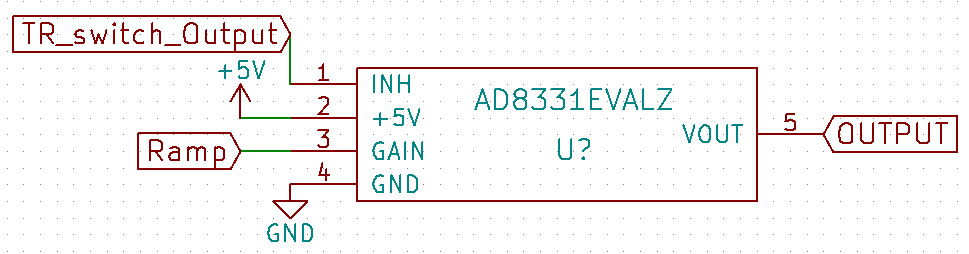
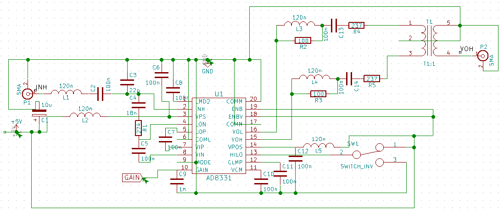

Module: MDL_TGC

Function: signal processing

Sub-Function: amplifying

The living tissus attenuate the acoustic wave that propagate inside them. In order to compensate this attenuation we have to amplify the received echoes gradually with the time. Indeed the attenuation is on the forme $\e^{-\alpha d}$ where $\alpha$ is the coefficient of attenuation and $d$ is the distance of propagation. Considering that the living tissus are non dispersive media, we have linearity between distance and time : $v=\dfrac{d}{t}$. So we have to compensate the exponential decay in time.

Input/Output:

If we consider a non dissipative (no attenuation) medium we identical scatterers and supposing that the echoes of each scatterer will be the same, one acoustic measurement will be as shown on the output figure. But the living tissus attenuate the acoustic wave so ideally (with no noise) the input will be as shown on the input figure. Due to the high attenuation of the living tissus some echoes will on order of the nV or less. This small amplitude can’t get measure with a conventional ADC so we have to amplify this signal.

input: 

output:

Solutions: 

version: V1.0

date: 12/04/2016

technology: integrated circuit (evaluation kit)

Source:

[https://github.com/echopen/electronic/tree/master/kicad/Modules/MDL_TGC/V1](https://github.com/echopen/electronic/tree/master/kicad/Modules/MDL_TGC/V1)

Scheme:

Input/Output: (no figure yet)

Pros/Cons/Constraint:

Pros: high amplification factor accessible

Cons: evaluation kit so expensive and take a big place

Constraint: 5V alimenation and a ramp from 0 to 1V to modify the gain of the VGA

version: V1.1

date: 19/08/2016

author: Jérôme

technology: integrated circuit

Source:

[https://github.com/echopen/electronic/tree/master/kicad/Modules/MDL_TGC/V1_1](https://github.com/echopen/electronic/tree/master/kicad/Modules/MDL_TGC/V1_1)

Scheme:

based on scheme found on [http://www.analog.com/media/en/technical-documentation/evaluation-documentation/154207235AD8331EB_a.pdf](http://www.analog.com/media/en/technical-documentation/evaluation-documentation/154207235AD8331EB_a.pdf)

Input/Output: (no figure yet)

Pros/Cons/Constraint:

Pros: high amplification factor accessible

Cons: 

Constraint: 5V alimenation and a ramp from 0 to 1V to modify the gain of the VGA

